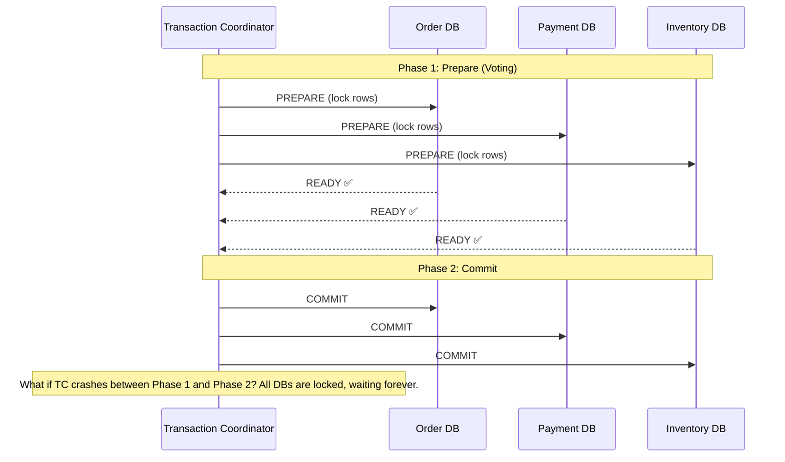
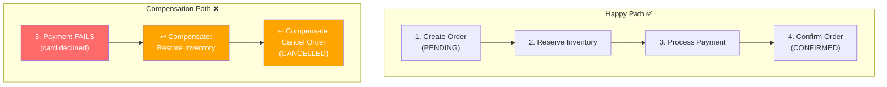
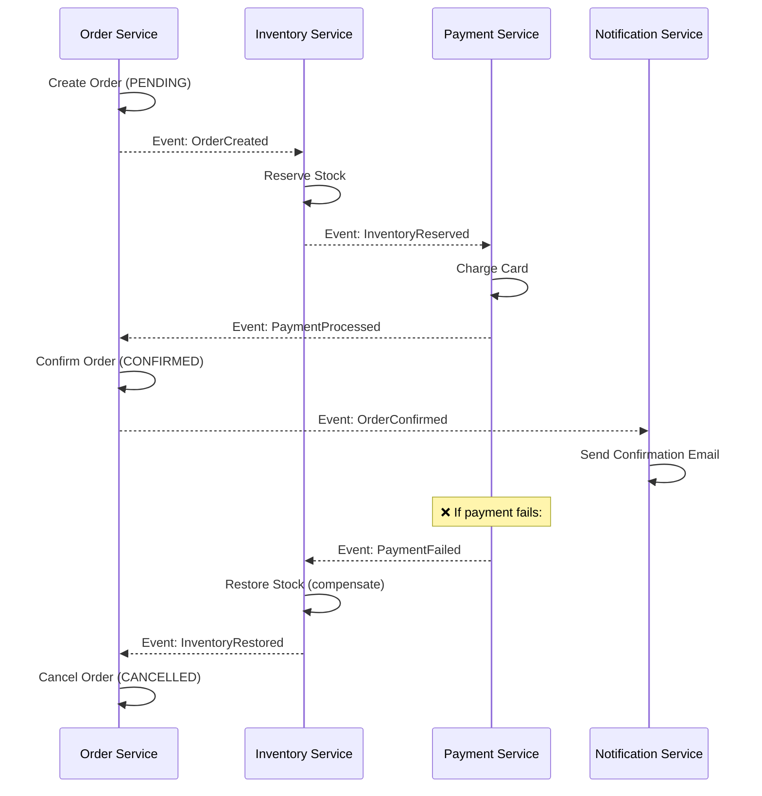
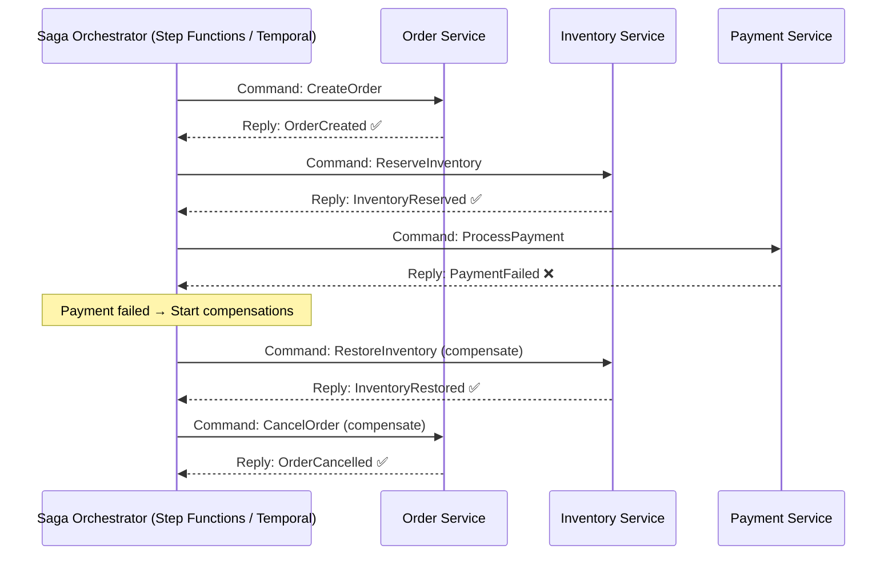

# 🔄 Distributed Data Management: The Saga Pattern Deep Dive

While Monoliths share a single Database (enjoying ACID transactions), Microservices demand **Database-per-Service**. This architectural choice introduces the most complex problem in distributed systems: **How do you maintain Data Consistency across multiple services if one of them fails?**

If the `Order Service` succeeds, but the `Payment Service` fails, and the `Inventory Service` succeeds, you end up with an Order that wasn't paid for but the inventory was deducted. This is unacceptable.

---

## 1. The Anti-Pattern: Two-Phase Commit (2PC)



In traditional systems, 2PC forces all databases to lock their rows, coordinate an "Are you ready?" phase, and then simultaneously commit.
- **Why Architects avoid it:** 2PC is synchronous, blocking, and heavily degrades throughput. It also creates a Single Point of Failure at the Transaction Coordinator.

| Problem | Impact |
|---------|--------|
| **Blocking** | All participants hold locks during both phases → high latency, low throughput |
| **Single Point of Failure** | If coordinator crashes, participants are stuck with locked resources |
| **Not cloud-friendly** | Requires all DBs to support XA protocol; DynamoDB, most managed DBs don't |
| **Scalability** | Lock contention increases linearly with participants |

---

## 2. The Solution: The Saga Pattern
A Saga is a sequence of **local transactions**. Each local transaction updates the database and publishes a message/event to trigger the next local transaction in the saga.

If a local transaction fails (e.g., credit card declined), the saga executes a **Compensating Transaction** to undo the changes made by the *previous* transactions.

### Saga Happy Path vs Compensation



### 2.1. Handling Compensations (Undos)
You cannot simply "rollback" a database transaction that was already committed 5 seconds ago in another microservice. You must logically reverse it:
- If `InventoryService.DeductStock()` succeeded -> The compensation is `InventoryService.RestoreStock()`.
- If `PaymentService.ChargeCard()` succeeded -> The compensation is `PaymentService.RefundCard()`.

### 2.2. Pivot Transactions
A Saga usually has a point of no return called the **Pivot Transaction**. Once this transaction succeeds, the Saga is virtually guaranteed to succeed until completion, and compensating transactions are no longer possible (e.g., `ShipmentService.DispatchPackage()`). Everything before it can be compensated. Everything after it is guaranteed to retry until success.

```
[Compensatable] → [Compensatable] → [PIVOT] → [Retriable] → [Retriable]
  Create Order      Reserve Stock     Charge     Ship         Send Email
  (can undo ✅)     (can undo ✅)     Card       (retry ♻️)   (retry ♻️)
                                     (no undo ❌)
```

---

## 3. Implementation Strategies

### Strategy A: Choreography (Event-Driven / Peer-to-Peer)



- **Pros:** Decentralized, loosely coupled, no single orchestrator to maintain.
- **Cons:** 
  - Cyclic dependencies can occur. 
  - Extremely difficult to track the current state of a Saga (Is the order stuck?).
  - Adding a new step requires modifying multiple services' event subscribers.

### Strategy B: Orchestration (Central Controller)



- **Pros:** 
  - Centralized logic: You can see the entire workflow in one place.
  - No cyclic dependencies.
  - Less complexity for participants (they just execute commands and reply).
- **Cons:** 
  - The Orchestrator can become a god-object (too much business logic).
  - Requires maintaining an infrastructure piece like AWS Step Functions, Temporal.io, or Camunda.

### Choreography vs Orchestration Decision

| Criteria | Choreography | Orchestration |
|----------|-------------|---------------|
| **Number of steps** | 2-4 steps | 4+ steps |
| **Visibility** | Hard to track saga state | Clear workflow visualization |
| **Coupling** | Loose (services only know events) | Medium (orchestrator knows all services) |
| **Error handling** | Distributed (each service handles) | Centralized (orchestrator handles) |
| **Debugging** | Hard (follow events through logs) | Easy (saga state in one place) |
| **Adding steps** | Modify multiple services | Modify orchestrator only |
| **Best for** | Simple sagas, event-heavy systems | Complex workflows, regulated industries |

---

## 4. Orchestration Tools

| Tool | Type | Best For |
|------|------|----------|
| **AWS Step Functions** | Managed state machine | AWS-native workflows, Lambda orchestration |
| **Temporal.io** | Durable execution framework | Complex business workflows, long-running sagas |
| **Camunda** | BPMN workflow engine | Enterprise, regulated industries, visual modeling |
| **Netflix Conductor** | Microservices orchestrator | Large-scale microservices coordination |
| **Custom (PostgreSQL + State Machine)** | DIY | Simple sagas, full control |

### AWS Step Functions Example

```json
{
  "Comment": "Order Processing Saga",
  "StartAt": "CreateOrder",
  "States": {
    "CreateOrder": {
      "Type": "Task",
      "Resource": "arn:aws:lambda:us-east-1:123:function:create-order",
      "Next": "ReserveInventory",
      "Catch": [{ "ErrorEquals": ["States.ALL"], "Next": "CancelOrder" }]
    },
    "ReserveInventory": {
      "Type": "Task",
      "Resource": "arn:aws:lambda:us-east-1:123:function:reserve-inventory",
      "Next": "ProcessPayment",
      "Catch": [{ "ErrorEquals": ["States.ALL"], "Next": "CompensateInventory" }]
    },
    "ProcessPayment": {
      "Type": "Task",
      "Resource": "arn:aws:lambda:us-east-1:123:function:process-payment",
      "Next": "ConfirmOrder",
      "Catch": [{ "ErrorEquals": ["States.ALL"], "Next": "CompensateInventory" }]
    },
    "CompensateInventory": {
      "Type": "Task",
      "Resource": "arn:aws:lambda:us-east-1:123:function:restore-inventory",
      "Next": "CancelOrder"
    },
    "CancelOrder": {
      "Type": "Task",
      "Resource": "arn:aws:lambda:us-east-1:123:function:cancel-order",
      "Next": "SagaFailed"
    },
    "ConfirmOrder": { "Type": "Succeed" },
    "SagaFailed": { "Type": "Fail", "Error": "SagaCompensated" }
  }
}
```

---

## 5. Architectural Rules for Sagas

1. **Idempotency is Mandatory:** Since network messages can be delivered more than once (At-Least-Once delivery), every local transaction and compensating transaction MUST be idempotent. `ChargeCard(id=50)` called twice must only charge the user once.
2. **Isolation Anomalies:** Sagas lack ACID Isolation. If a Saga takes 10 seconds to complete, other transactions might read partially updated data (Lost Updates, Dirty Reads).
   - *Semantic Lock:* The `OrderService` sets the order status to `PENDING` during the Saga. If another request tries to cancel an order that is `PENDING`, the service rejects it.
3. **The Outbox Pattern is Required:** A service cannot safely update its local DB and publish an event to the Message Broker in a single step. You must use the outbox pattern to guarantee the event is published only if the local DB transaction commits.

### Saga Isolation Countermeasures

| Anomaly | Description | Countermeasure |
|---------|-------------|---------------|
| **Lost Update** | Saga A reads data, Saga B overwrites it, Saga A overwrites with stale data | Semantic Lock: `status = PENDING` prevents other writes |
| **Dirty Read** | Saga reads uncommitted data from another saga | Read only `CONFIRMED` status records, ignore `PENDING` |
| **Non-repeatable Read** | Same query returns different results during saga execution | Versioned reads: `WHERE version = N` |

---

## 🔥 Real Saga Problems

### Problem 1: Saga Timeout — Is It Still Running?
**What happened:** Order saga started but Payment service is slow (30 seconds). Is the saga stuck? Should we compensate? The order is in PENDING state for the user.
**Fix:** Implement saga timeout. If saga doesn't complete within 60 seconds, mark as TIMED_OUT and trigger compensation. Show user "Processing..." with a polling endpoint.

### Problem 2: Compensation Fails
**What happened:** Payment charged successfully, then shipping failed. Saga tries to refund → Payment service is down. Now the user is charged but has no shipment and no refund.
**Fix:** Compensating transactions must retry until they succeed (they're retriable, not compensatable). Use exponential backoff + DLQ. Never give up on compensations — store them in a persistent retry queue.

### Problem 3: Saga State Lost
**What happened:** Orchestrator restarts between steps 2 and 3. Saga state was in memory only. Now nobody knows if inventory was reserved or payment was processed.
**Fix:** Persist saga state in database. Each step update: `UPDATE saga SET current_step = 'payment', status = 'RUNNING'`. On restart, orchestrator resumes from last persisted state. This is exactly what Temporal.io does automatically.

---

## 📍 Case Study Answer

> **Scenario:** Design a saga for your file processing pipeline: Upload → Chunk → Index → Notify.

```
Saga: FileProcessingSaga (Choreography — simple 4-step pipeline)

Step 1: FileUploaded (S3 event → SQS)
  Action: Save file metadata (status: UPLOADED)
  Compensation: Delete file from S3, update status: FAILED

Step 2: FileChunked (Lambda)
  Action: Split file into chunks, save chunks (status: CHUNKED)
  Compensation: Delete chunks from S3, update status: UPLOAD_FAILED

Step 3: ChunksIndexed (Lambda → Elasticsearch)
  Action: Index chunks in Elasticsearch (status: INDEXED)
  Compensation: Delete index entries for this file

Step 4: ProcessingComplete (PIVOT — no compensation needed)
  Action: Update status: COMPLETED, notify user
  Compensation: None (notification is retriable, not compensatable)

Idempotency: file_id + version_id as idempotency key
Timeout: 5 minutes per step, 15 minutes total saga
DLQ: Failed messages → DLQ → CloudWatch alarm → Slack alert
```
