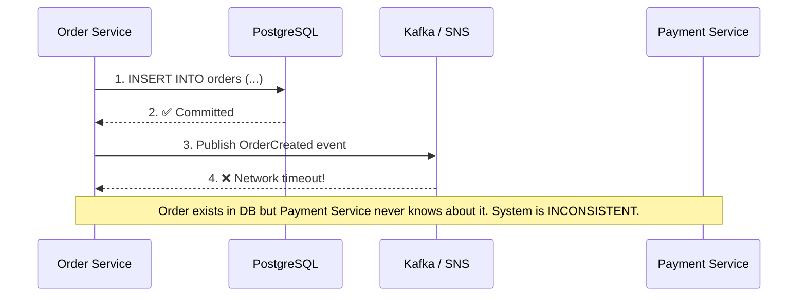
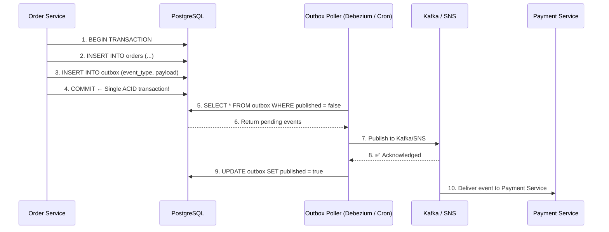
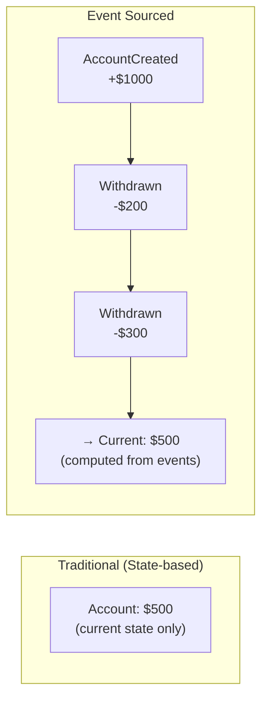
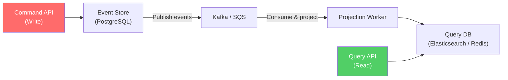
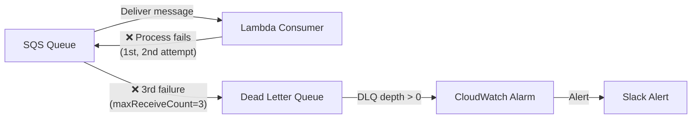

# ⚡ Deep Dive: Event-Driven Architecture (EDA) & Messaging Systems

While junior developers focus on building RESTful APIs, Senior Architects realize that synchronous HTTP calls create tightly coupled systems that fail like dominoes. **Event-Driven Architecture (EDA)** decouples services by passing state changes (Events) through message brokers. 

However, EDA introduces severe complexities regarding Data Consistency and Delivery Guarantees.

---

## 1. The Core Problem: The Dual-Write Problem



When your `Order Service` creates an order, it must do two things:
1. Save the order to its local Database (e.g., PostgreSQL).
2. Publish an `OrderCreated` event to Kafka/SNS so the `Payment Service` knows to charge the user.

**The Failure Scenario:**
What if step 1 succeeds (DB committed), but step 2 fails (Network times out when calling Kafka)? The order exists, but the user is never charged. The system is fundamentally corrupted. 

You **cannot** wrap a DB transaction and a Network call in the same ACID transaction.

### 🛠️ The Solution: Transactional Outbox Pattern



Instead of publishing directly to the Message Broker, the `Order Service` updates the `orders` table AND inserts a record into an `outbox` table **in the same ACID database transaction**.

A separate background process (e.g., Debezium or a polling Cronjob) reads the `outbox` table and pushes those events to Kafka/SNS. 
- Automatically guarantees **At-Least-Once** delivery. If the broker is down, the events wait safely in the DB outbox.

### Outbox Implementation Options

| Approach | How | Pros | Cons |
|----------|-----|------|------|
| **Polling** (Cron/Scheduler) | Query outbox table every N seconds | Simple to implement | Latency (polling interval), DB load |
| **Debezium (CDC)** | Capture DB change log (WAL) stream | Real-time, no polling overhead | Complex setup, Kafka required |
| **AWS DynamoDB Streams** | Built-in change stream on DynamoDB tables | Serverless, managed | DynamoDB-only |

---

## 2. Event Types: Domain Events vs Integration Events

| | Domain Event | Integration Event |
|---|---|---|
| **Scope** | Within a bounded context | Between bounded contexts / services |
| **Naming** | Past tense: `OrderPlaced`, `PaymentReceived` | Same, but includes full context for consumers |
| **Schema** | Can evolve freely (internal) | Must be versioned, backwards-compatible |
| **Payload** | Can reference internal entities by ID | Must be self-contained (include enough data) |

### Event Schema Evolution

```json
// Version 1
{ "type": "OrderCreated", "version": 1, "orderId": "o-123", "amount": 99.99 }

// Version 2 (backwards compatible: new field added)
{ "type": "OrderCreated", "version": 2, "orderId": "o-123", "amount": 99.99, "currency": "USD" }

// Version 3 (BREAKING: field renamed → requires new event type or adapter)
// ❌ Don't rename fields. Add new ones, deprecate old ones.
```

**Rules:**
- ✅ Add new optional fields (backwards compatible)
- ✅ Add new event types
- ❌ Never remove or rename fields
- ❌ Never change field types (string → number)
- Use schema registry (Confluent, AWS Glue) for enforcement

---

## 3. Event Sourcing vs CQRS

### Event Sourcing



Instead of storing the *current state* of an entity, you store an immutable sequence of *events*.
- *Traditional DB:* `Account Balance: $500`
- *Event Sourced DB:* `[Created: +$1000], [Withdrawn: -$200], [Withdrawn: -$300]`
- **Trade-off:** Calculating the current state takes time (Requires replaying events). It necessitates generating "Snapshots" every 100 events to optimize performance.

### CQRS (Command Query Responsibility Segregation)



Separates the application into the **Command side** (Insert/Update/Delete) and the **Query side** (Read).
- The Command API writes to a highly normalized PostgreSQL / Event Store.
- The Query API reads from a heavily denormalized Elasticsearch / MongoDB.
- **How they sync:** The Command side publishes events (via Kafka/SNS), which are consumed by projection workers that update the Query database.

**Your Project Uses CQRS:**
- **Write path:** File upload → S3 → SQS → Lambda (chunk + transform)
- **Read path:** Client → API → Elasticsearch (denormalized search index)
- SQS acts as the event channel between write and read sides

---

## 4. Message Broker Comparison

| Feature | SQS | SNS | Kafka | RabbitMQ | EventBridge |
|---------|-----|-----|-------|----------|-------------|
| **Pattern** | Queue (point-to-point) | Pub/Sub (fan-out) | Log (stream) | Queue + Pub/Sub | Event bus (routing) |
| **Ordering** | FIFO optional | No | Per partition | Per queue | No |
| **Replay** | ❌ | ❌ | ✅ (configurable retention) | ❌ | ✅ (archive) |
| **Throughput** | ~3,000 msg/s (standard), 300/s (FIFO) | ~30M msg/s | Millions/s | ~50K msg/s | ~10K events/s |
| **Retention** | 14 days max | No retention | Unlimited (configurable) | Until consumed | 24h (90 days archive) |
| **DLQ** | ✅ Built-in | Via SQS subscription | Consumer-level | ✅ Built-in | ✅ Built-in |
| **Managed** | Fully (AWS) | Fully (AWS) | MSK (AWS) or self-hosted | Self-hosted or CloudAMQP | Fully (AWS) |
| **Best for** | Task queues, decoupling | Fan-out notifications | Event streaming, replay, analytics | Complex routing, RPC | AWS service integration |

**Decision Guide:**
- **Simple queue processing** → SQS (your project uses this)
- **Fan-out (1 event → multiple consumers)** → SNS + SQS subscriptions
- **Event replay, ordering, stream processing** → Kafka
- **AWS service orchestration** → EventBridge

---

## 5. Dealing with Message Delivery Guarantees

```mermaid
graph TD
    subgraph "At-Most-Once"
        P1["Producer"] -->|"Send"| B1["Broker"]
        B1 -->|"Deliver once<br/>(may lose)"| C1["Consumer"]
        style C1 fill:#ffa502,color:#fff
    end
    
    subgraph "At-Least-Once"
        P2["Producer"] -->|"Send + ACK"| B2["Broker"]
        B2 -->|"Deliver, retry<br/>until ACKed"| C2["Consumer"]
        C2 -->|"May receive<br/>DUPLICATES"| C2
        style C2 fill:#339af0,color:#fff
    end
    
    subgraph "Exactly-Once Processing"
        P3["Producer"] -->|"Send + ACK"| B3["Broker"]
        B3 -->|"Deliver + retry"| C3["Consumer +<br/>Idempotency"]
        C3 -->|"Dedup via<br/>event_id table"| DB3["DB"]
        style C3 fill:#51cf66,color:#fff
    end
```



1. **At-Most-Once (Fire and Forget):** 
   - Good for metrics logging or IoT sensor data where losing a packet isn't fatal.
2. **At-Least-Once (The Industry Standard):** 
   - SNS, SQS, and Kafka default to this. If the consumer (Lambda) fails to return a 200 OK within the Visibility Timeout, SQS makes the message visible again. The consumer receives the same message twice.
3. **Exactly-Once Processing:** 
   - Impossible to guarantee strictly via network. You must design your consumer logic to be **Idempotent**. 
   - **Idempotency Implementation:** The `Payment Service` must maintain a `processed_event_ids` table. When receiving an event, it checks if `event_id` exists. If yes, silently acknowledge and drop it. This protects the customer from being double-charged during SQS retries.

### Idempotency Implementation

```typescript
async function handlePaymentEvent(event: PaymentEvent): Promise<void> {
  // Check idempotency key
  const exists = await db.query(
    'SELECT 1 FROM processed_events WHERE event_id = $1',
    [event.eventId]
  );
  
  if (exists.rows.length > 0) {
    console.log(`Event ${event.eventId} already processed, skipping`);
    return; // Idempotent: no duplicate processing
  }
  
  // Process in a transaction with idempotency record
  await db.transaction(async (tx) => {
    await tx.query('INSERT INTO processed_events (event_id) VALUES ($1)', [event.eventId]);
    await tx.query('UPDATE accounts SET balance = balance - $1 WHERE id = $2', [event.amount, event.accountId]);
  });
}
```

---

## 6. Error Handling: Poison Pills & DLQs



A **Poison Pill** is a message that cannot be processed (e.g., invalid JSON format or violating business logic). 
- If unhandled, the worker throws an exception, the message goes back to the queue, and the worker consumes it again, infinitely looping and blocking the entire queue.

**Architectural Defense Mechanism:**
- Always configure a **Dead Letter Queue (DLQ)**. 
- Set `maxReceiveCount` (e.g., 3). If the message fails 3 times, SQS kicks it into the DLQ. 
- Configure CloudWatch Alarms on the DLQ depth. If `DLQ > 0`, alert the Slack channel for an engineer to manually inspect the payload.

---

## 🔥 Real EDA Problems

### Problem 1: Event Ordering Issues
**What happened:** User updated profile 3 times. Events `ProfileUpdated` v1, v2, v3 were published. Consumer processed them out of order (v3, v1, v2) → profile shows v2 data (not the latest).
**Fix:** Use FIFO SQS with message group ID, or Kafka with partition key = user_id. Alternatively, include a version number/timestamp in events and use "last-write-wins" based on event timestamp.

### Problem 2: Consumer Lag → Stale Read Model
**What happened:** 50,000 events queued during peak traffic. CQRS read model (Elasticsearch) was 15 minutes behind the write model. Users saw stale data.
**Fix:** Scale consumers horizontally (more Lambda concurrency, more Kafka consumer group members). Set SLO for consumer lag (< 30 seconds). Monitor `ApproximateAgeOfOldestMessage` in SQS.

### Problem 3: Event Schema Change Breaks Consumers
**What happened:** Order Service added a required field `currency` to `OrderCreated` event. Payment Service didn't know → deserialization failed → all messages went to DLQ.
**Fix:** Never add required fields. Only add optional fields with defaults. Use schema registry. Deploy consumers before producers when adding new fields.

---

## 📍 Case Study Answer

> **Scenario:** Your file-processing pipeline occasionally processes the same file twice due to SQS at-least-once delivery. Design a solution.

**Solution:** Idempotency key based on S3 object key + version ID:
```
1. S3 event triggers SQS message with { bucket, key, versionId }
2. Lambda receives message
3. CHECK: SELECT 1 FROM processing_log WHERE s3_key = $1 AND version_id = $2
4. IF EXISTS → Delete SQS message, skip processing
5. IF NOT → Process file, INSERT INTO processing_log, delete SQS message
6. Use DynamoDB conditional write for atomic check-and-insert
```
