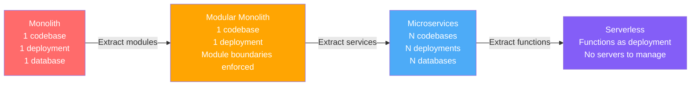
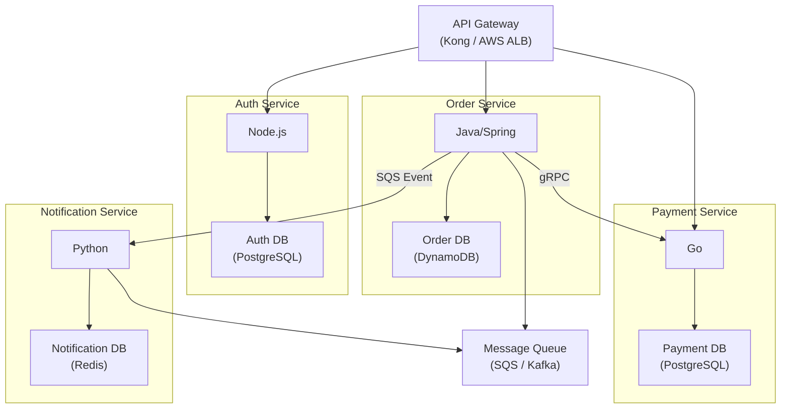
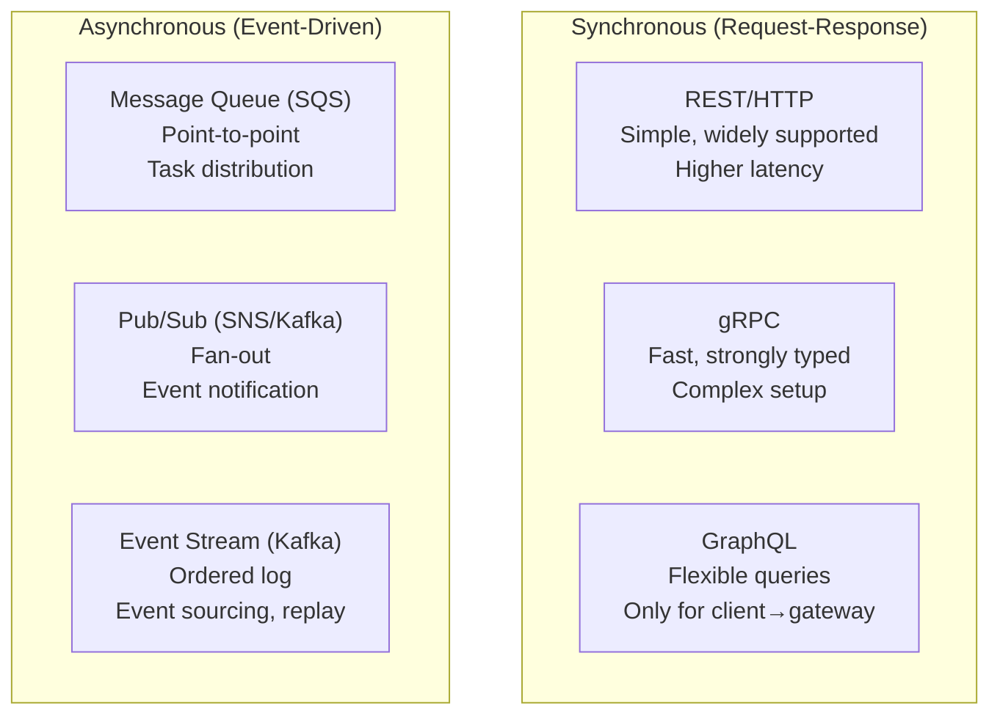
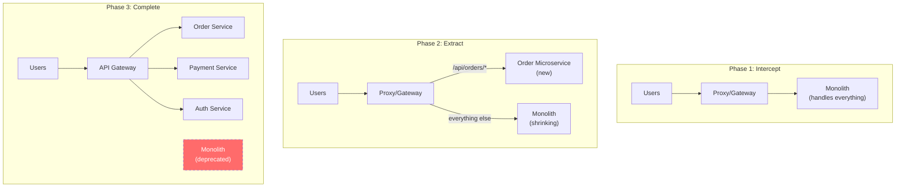
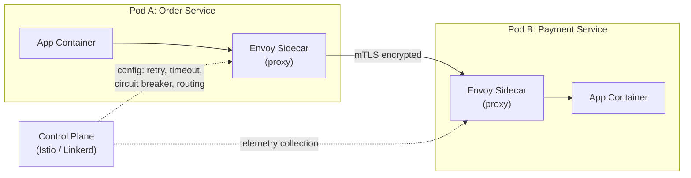

# 🏗️ Architecture Styles: Monolith → Modular Monolith → Microservices

Choosing an architecture style is the **highest-impact decision** an architect makes. It affects team structure, deployment speed, operational cost, and system reliability for years. Yet most teams choose microservices because of hype, not because of actual need.

> "If you can't build a well-structured monolith, what makes you think microservices is the answer?" — Simon Brown

---

## The Architecture Spectrum



---

## 1. Monolithic Architecture

All functionality in a **single codebase**, deployed as a **single unit**, using a **single database**.

```
┌──────────────────────────────────────┐
│           Monolith Application        │
│  ┌──────┐ ┌──────┐ ┌──────────────┐ │
│  │ Auth │ │Orders│ │   Payments   │ │
│  │Module│ │Module│ │    Module    │ │
│  └──┬───┘ └──┬───┘ └──────┬───────┘ │
│     │        │             │         │
│  ┌──┴────────┴─────────────┴───────┐ │
│  │     Shared Database (PostgreSQL) │ │
│  └─────────────────────────────────┘ │
└──────────────────────────────────────┘
```

### Pros
- **Simple development:** One IDE, one build, one debug session
- **Simple deployment:** One artifact, one deploy pipeline
- **Simple testing:** E2E tests in one process, no network mocking
- **No network overhead:** Function calls, not HTTP/gRPC calls
- **ACID transactions:** Single database → real transactions, real JOINs
- **Easy refactoring:** IDE rename works across the entire codebase

### Cons
- **Scaling is all-or-nothing:** Can't scale just the payment module; must scale the entire app
- **One bad deploy breaks everything:** A bug in the notification module crashes the order API
- **Technology lock-in:** Entire codebase uses one language, one framework
- **Long build/deploy cycles:** As codebase grows → build time 5min → 20min → 45min
- **Ownership unclear:** 50 developers committing to the same repo → merge conflicts, unclear boundaries
- **Spaghetti code over time:** Without discipline, modules call each other's internals → tangled dependencies

### When to Use
- Team < 10 developers
- Domain not yet well understood (still exploring)
- MVP / startup phase (speed > architecture purity)
- Simple CRUD with straightforward business logic

---

## 2. Modular Monolith — The Sweet Spot

A monolith with **enforced module boundaries**. Each module has its own models, services, and controllers. Modules communicate via **well-defined interfaces**, not direct database access.

```
┌──────────────────────────────────────────────┐
│            Modular Monolith                    │
│  ┌─────────────┐    ┌─────────────┐          │
│  │  Auth Module │    │ Order Module│          │
│  │  ┌────────┐ │    │  ┌────────┐ │          │
│  │  │ Routes │ │    │  │ Routes │ │          │
│  │  │Service │ │    │  │Service │ │          │
│  │  │  Repo  │◄├────┤► │  Repo  │ │          │
│  │  └────────┘ │    │  └────────┘ │          │
│  │  auth_tables│    │ order_tables │          │
│  └─────────────┘    └─────────────┘          │
│         │                   │                 │
│  ┌──────┴───────────────────┴──────────────┐ │
│  │  Shared PostgreSQL (schema per module)   │ │
│  └─────────────────────────────────────────┘ │
└──────────────────────────────────────────────┘

Rules:
  ✅ Auth calls Order via OrderService.getOrder(id) (interface)
  ❌ Auth queries ORDER_ITEMS table directly (database coupling)
```

### Enforcement Techniques
- **Separate schemas/namespaces** per module in the database
- **Package-private classes** (Java modules, TS barrel exports — only export the public API)
- **ArchUnit tests** (Java) or ESLint rules (TS) to detect cross-module imports
- **Event bus for async communication** between modules (even in-process)

### Your Project Uses This
Your file-processor project follows **Hexagonal Architecture** (a form of Modular Monolith):
- Domain layer has no external dependencies
- Application layer orchestrates via ports
- Infrastructure layer implements adapters (S3, SQS, Elasticsearch)
- Modules communicate via well-defined interfaces

### Pros (over Monolith)
- Clear boundaries → easier to extract into microservices later
- Each module can have its own testing strategy
- Ownership per module → separate teams can own separate modules
- Same deployment simplicity as monolith

### When to Use
- Team 5-30 developers
- Domain is understood, clear bounded contexts identified
- Need to prepare for eventual microservices migration
- **Default recommendation** for most projects

---

## 3. Microservices Architecture

Each service is **independently deployable, independently scalable**, and owns its own database.



### Pros
- **Independent scaling:** Scale Payment service to 50 instances during Black Friday, keep Notification at 5
- **Independent deployment:** Deploy Order service 10 times/day without touching Auth service
- **Technology freedom:** Order in Java (team expertise), Notification in Python (ML team), Payment in Go (performance)
- **Fault isolation:** Payment crashes ≠ Order list unavailable (with proper circuit breakers)
- **Team autonomy:** Each team owns their service end-to-end (code, deploy, monitor, on-call)

### Cons
- **Operational complexity:** 20 services × (deploy pipeline + monitoring + logging + alerting) = massive overhead
- **Distributed data:** No JOINs across services, eventual consistency, Saga pattern for transactions
- **Network latency:** Every inter-service call adds 1-10ms + potential failure
- **Debugging nightmare:** One user request spans 7 services → need distributed tracing (OpenTelemetry)
- **Testing complexity:** E2E tests require all services running → contract testing becomes essential
- **Data consistency:** No ACID across services → eventual consistency, compensating transactions

### When to Use
- Team > 30 developers (multiple autonomous teams)
- Services have **genuinely different scaling needs**
- Services have **genuinely different technology needs**
- Organization needs **independent deployment cadence** per team
- Domain is well-understood with clear bounded contexts

---

## 4. Serverless Architecture

Compute as **functions** — no servers to manage. Pay only for execution time.

| Aspect | Traditional | Serverless |
|--------|------------|------------|
| **Unit of deployment** | Container/VM | Single function |
| **Scaling** | Manual ASG rules | Automatic, per-request |
| **Cost model** | Pay for reserved capacity | Pay per invocation + duration |
| **Cold start** | None (always running) | 50ms - 5s depending on runtime |
| **Max execution time** | Unlimited | 15 minutes (Lambda) |
| **State** | In-memory, files | Must be external (S3, DynamoDB) |

**Your project uses this:** File upload → S3 → SQS → **Lambda** (chunking + indexing) → Elasticsearch

### When to Use
- Event-driven workloads (file processing, webhooks, scheduled tasks)
- Unpredictable traffic (0 to 10,000 requests in seconds)
- Short-lived operations (< 15 minutes)
- Cost optimization for low-traffic services

### When to Avoid
- Long-running processes (> 15 minutes)
- Latency-sensitive (cold starts are real)
- High-throughput steady-state (EC2/ECS is cheaper at scale)
- Complex stateful workflows (use Step Functions + Lambda instead)

---

## 5. Key Supporting Patterns

### Service Discovery

How does Service A find Service B's address?

| Pattern | How | Example |
|---------|-----|---------|
| **Client-side discovery** | Client queries a registry, gets address list, load balances itself | Eureka + Ribbon (Spring) |
| **Server-side discovery** | Client calls a load balancer/DNS, which routes to healthy instance | AWS ALB, Kubernetes Service |
| **DNS-based** | Service registers a DNS record, client resolves hostname | Kubernetes `order-service.default.svc.cluster.local` |

**Recommendation:** In Kubernetes, use built-in DNS-based service discovery. On AWS without K8s, use ALB + target groups or Cloud Map.

### API Gateway Patterns

| Pattern | What | When |
|---------|------|------|
| **Simple Reverse Proxy** | Route `/api/orders/*` → Order Service | Small number of services |
| **Backend for Frontend (BFF)** | Dedicated gateway per client type (mobile, web, admin) | Different clients need different API shapes |
| **API Composition** | Gateway aggregates data from multiple services into one response | Client needs data from 3+ services in one call |
| **Gateway Offloading** | Gateway handles auth, rate limiting, caching, TLS termination | Centralize cross-cutting concerns |

### Inter-Service Communication



| | Synchronous | Asynchronous |
|---|---|---|
| **Coupling** | Temporal coupling (both must be online) | Decoupled (producer doesn't wait) |
| **Latency** | Immediate response | Variable (ms to minutes) |
| **Error handling** | Caller handles errors directly | DLQ, retry, compensating tx |
| **Debugging** | Easier (request-response trace) | Harder (eventual, event chains) |
| **Best for** | Queries, real-time responses | Commands, notifications, background work |

**Rule of thumb:** Use sync for queries ("get order status"), async for commands ("process this payment").

### Conway's Law & Team Topologies

> "Any organization that designs a system will produce a design whose structure is a copy of the organization's communication structure." — Melvin Conway

**In practice:**
- If you have 3 teams, you'll get 3 services (whether you want to or not)
- If teams share a codebase, they'll create a monolith (whether you want to or not)
- **Design your team structure first**, then the architecture will follow naturally

| Team Topology | Architecture Result |
|--------------|-------------------|
| 1 full-stack team | Monolith (correct!) |
| 3 feature teams sharing 1 repo | Modular monolith |
| 5 autonomous teams, each owns a domain | Microservices |
| Platform team + feature teams | Microservices + shared platform |

### Migration: Strangler Fig Pattern

When migrating from Monolith to Microservices, **never do a big-bang rewrite**. Instead, gradually "strangle" the monolith:



**Steps:**
1. Put a proxy/gateway in front of the monolith
2. Extract one module at a time into a microservice
3. Route new traffic to the microservice, old traffic stays on monolith
4. Once the microservice is stable, remove the module from monolith
5. Repeat until monolith is empty

---

## 6. Service Mesh — Managing Service-to-Service Communication

A **Service Mesh** is an infrastructure layer that handles service-to-service communication transparently, usually via sidecar proxies.



### What a Service Mesh Handles
- **mTLS** between all services (zero-trust networking)
- **Retry, timeout, circuit breaker** without changing application code
- **Traffic splitting** (canary: 5% to v2, 95% to v1)
- **Observability** (distributed tracing, metrics per service pair)
- **Rate limiting** per service
- **Access control** (Service A can call Service B, but not Service C)

### When You DON'T Need a Service Mesh
- < 10 services (operational overhead not justified)
- Not using Kubernetes (service mesh assumes K8s)
- Simple request-response patterns (libraries like Resilience4j handle retry/CB)
- Team lacks Kubernetes expertise

---

## 🔥 Real Problems & Anti-Patterns

### Problem 1: The Distributed Monolith
**What happened:** Team migrated to 15 microservices but all services share one database, deploy together, and can't be released independently.
**Root cause:** Services were split by technical layer (API service, business logic service, data service) instead of by **business domain** (Order, Payment, Notification).
**Fix:** Services must own their data. Split by bounded context, not by layer. If two services can't be deployed independently, they're not microservices.

### Problem 2: Service Boundary Wrong → Too Many Cross-Service Calls
**What happened:** Rendering one product page requires calling 12 microservices sequentially (Product → Pricing → Inventory → Reviews → Recommendations → ...) → page load time: 3 seconds.
**Root cause:** Services are too fine-grained. "Nano-services" anti-pattern.
**Fix:** Merge tightly-coupled services. If Service A always calls Service B, they should be one service. Use API Composition pattern for read-heavy aggregations.

### Problem 3: Distributed Debugging Nightmare
**What happened:** Customer reports order failure. Engineer checks Order service logs → nothing. Checks Payment logs → timeout error. Checks API Gateway logs → 502. Spent 4 hours correlating logs across 8 services.
**Root cause:** No distributed tracing, no correlation ID.
**Fix:** Implement OpenTelemetry with trace propagation. Every request gets a `trace_id` that flows through ALL services. Use Grafana Tempo / Jaeger to visualize the entire call chain.

### Problem 4: Deployment Dependency Hell
**What happened:** Order Service v2 breaks Payment Service v1 because they changed the gRPC contract without versioning.
**Root cause:** No API versioning, no contract testing.
**Fix:** 
- Contract testing (Pact) — consumer defines expected contract, provider verifies it
- API versioning (`/v1/orders`, `/v2/orders`)
- Backwards-compatible changes only (add fields, never remove)
- Protocol buffers enforce backwards compatibility

### Problem 5: Shared Library Versioning
**What happened:** 15 services depend on `shared-utils` library v1.3. Team updates to v1.4 with breaking change. Now must update and redeploy all 15 services simultaneously → we're back to a monolith.
**Root cause:** Shared libraries create coupling.
**Fix:** Keep shared libraries thin (logging, HTTP client, tracing). Business logic should NOT be in shared libraries. Use semantic versioning and maintain backwards compatibility.

### Problem 6: "Microservices Because Netflix Does It"
**What happened:** 3-person startup spent 6 months building Kubernetes cluster, service mesh, API gateway, CI/CD for 12 microservices... instead of building the product. Zero users.
**Root cause:** Resume-driven development. Solving scaling problems they don't have.
**Fix:** Start with monolith. Extract services only when you have a specific scaling or organization problem that requires it.

---

## 📍 Architect's Decision Framework

```
Q1: Team size?
  < 10 developers → Monolith or Modular Monolith
  10-30 developers → Modular Monolith
  > 30 developers → Consider Microservices

Q2: Do different parts need different scaling?
  No → Monolith/Modular Monolith
  Yes → Microservices (but only for the parts that need it)

Q3: Do different parts need different technologies?
  No → Monolith/Modular Monolith  
  Yes → Microservices

Q4: Does the team have DevOps/Observability capabilities?
  No → NEVER microservices (you'll drown in operational complexity)
  Yes → Microservices if Q1-Q3 also point to it

Q5: Is the domain well-understood?
  No → Monolith (easier to refactor when boundaries change)
  Yes → Modular Monolith or Microservices
```

> **📍 Architect's Rule of Thumb:**
> "Never design Microservices from day one if your team lacks DevOps/Observability capabilities. Start with a Modular Monolith."
> 
> **The answer is YES, strongly agree.** Microservices without observability is like driving blindfolded at 200 km/h. You can't debug distributed systems by reading log files on each server. You need distributed tracing, centralized logging, metrics dashboards, and alerting BEFORE you decompose. Build the observability stack first (which your project already has: Prometheus, Loki, Tempo, Grafana, OTel), then extract services one at a time via Strangler Fig pattern.
