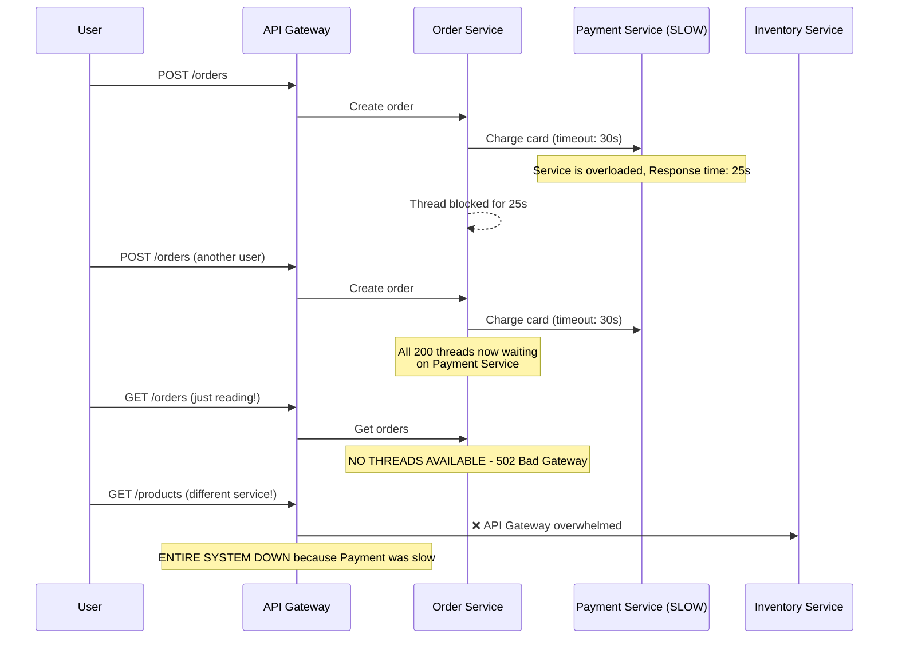
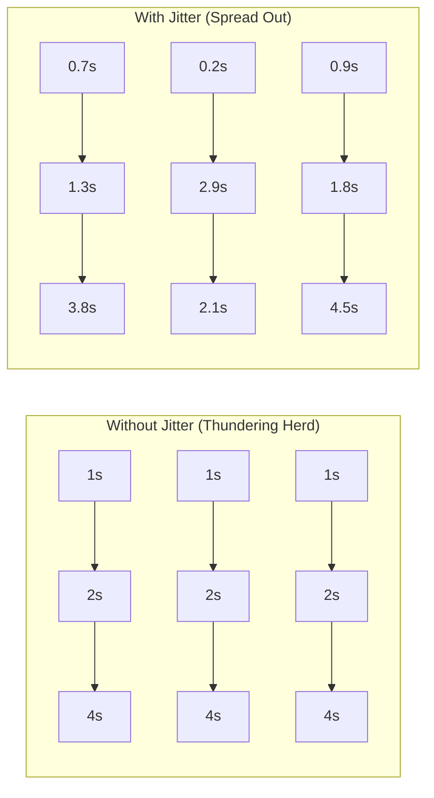
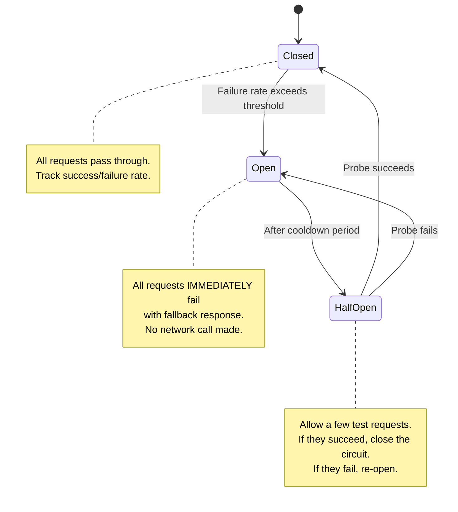
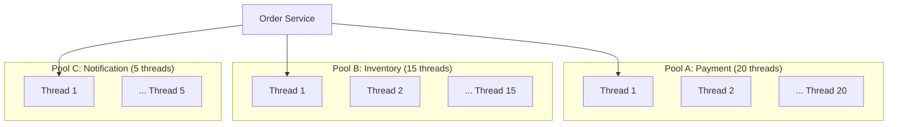

# 🛡️ Reliability: Resiliency Patterns — Designing for Failure

> "Everything fails, all the time." — Werner Vogels, CTO Amazon

In distributed systems, failure is not a possibility — it's a **certainty**. Networks partition, servers crash, disks corrupt, dependencies time out. The question is not "will it fail?" but "when it fails, does the whole system go down?"

A **resilient** system degrades gracefully under stress, recovers automatically, and never takes down unrelated functionality because one component failed.

---

## The Cascading Failure Problem



**This is a cascading failure.** One slow service (Payment) consumed all resources of its caller (Order), which then couldn't serve ANY requests (including reads), which then overwhelmed the API Gateway, which then blocked ALL services.

**The fix:** Apply multiple resiliency patterns in layers.

---

## 1. Timeouts — The First Line of Defense

Every network call MUST have a timeout. **No exceptions.**

### Types of Timeouts

| Timeout Type | What It Controls | Typical Value |
|-------------|-----------------|---------------|
| **Connection timeout** | Time to establish TCP connection | 1-5 seconds |
| **Read/Response timeout** | Time to receive the first byte | 5-30 seconds |
| **Overall timeout** | Total time for the entire request | 10-60 seconds |
| **Idle timeout** | Kill connections sitting idle | 30-300 seconds |

### The Deadly Default
Many HTTP clients have **no timeout by default** (or 0 = infinite). This means a slow downstream can block your thread FOREVER.

```typescript
// ❌ WRONG — no timeout, thread blocked indefinitely
const response = await axios.get('http://payment-service/charge');

// ✅ CORRECT — explicit timeout
const response = await axios.get('http://payment-service/charge', {
  timeout: 5000, // 5 seconds total
  signal: AbortSignal.timeout(5000),
});
```

### Timeout Budget Pattern
For a chain of calls (A → B → C), the total timeout must be allocated:
```
User timeout: 10s
  → API Gateway to Order Service: 8s budget
    → Order Service to Payment: 3s budget
    → Order Service to Inventory: 3s budget
    → Processing + serialization: 2s budget
```

---

## 2. Retry with Exponential Backoff & Jitter

When a call fails due to a transient error (network blip, server restart, rate limit), retrying can succeed. But naive retrying creates more problems.

### The Wrong Way: Immediate Retry

```
Request 1: FAIL → Retry immediately → FAIL → Retry immediately → FAIL
Request 2: FAIL → Retry immediately → FAIL → Retry immediately → FAIL
Request 3: FAIL → Retry immediately → FAIL → Retry immediately → FAIL
... 1000 clients doing this simultaneously → DDoS your own service!
```

### Exponential Backoff

Double the delay between each retry:
```
Attempt 1: Wait 1s
Attempt 2: Wait 2s  
Attempt 3: Wait 4s
Attempt 4: Wait 8s (give up after this)
```

### Adding Jitter (Critical!)

Without jitter, if 10,000 clients all fail at the same time (e.g., server restart), they will all retry at exactly the same intervals → creating synchronized load spikes ("thundering herd").

```
// ❌ Without jitter — synchronized retries
delay = base * 2^attempt

// ✅ Full jitter — randomized delays
delay = random(0, base * 2^attempt)

// ✅ Equal jitter — balanced approach
half = base * 2^attempt / 2
delay = half + random(0, half)
```



### What to Retry (and What NOT to)

| HTTP Status | Retry? | Reason |
|-------------|--------|--------|
| 408, 429 | ✅ Yes | Request Timeout, Rate Limited (transient) |
| 500, 502, 503 | ✅ Yes | Server error (may be transient) |
| 400, 401, 403 | ❌ No | Client error (retrying won't help) |
| 404 | ❌ No | Resource doesn't exist | 
| 409 | ⚠️ Maybe | Conflict — depends on idempotency |

**Critical Rule:** Only retry **idempotent** operations. Retrying `POST /create-order` without idempotency key → creates duplicate orders!

---

## 3. Circuit Breaker — Stop Calling a Dead Service

Inspired by electrical circuit breakers. When a downstream service is failing, **stop calling it** to prevent resource exhaustion and give it time to recover.



### Circuit Breaker Configuration

| Parameter | Typical Value | Explanation |
|-----------|--------------|-------------|
| Failure threshold | 50% | Open circuit when >50% of requests fail |
| Sliding window | 10-60 seconds | Time window for calculating failure rate |
| Minimum requests | 10-20 | Don't trip circuit on 1 out of 2 failures |
| Cooldown period | 15-60 seconds | Time to wait before trying again (half-open) |
| Probe count | 1-3 | Number of test requests in half-open state |

### Why Circuit Breaker BEFORE Retry

```
Order of application matters:

✅ CORRECT: Circuit Breaker wraps Retry
   → If circuit is OPEN, fail fast (no retries wasted)
   → If circuit is CLOSED, retry up to 3 times
   → If retries keep failing, circuit trips OPEN

❌ WRONG: Retry wraps Circuit Breaker  
   → Retry attempts even when circuit is OPEN (pointless)
   → Wasted time and resources on calls that will never succeed
```

---

## 4. Rate Limiting — Protect Against Abuse

Rate limiting controls how many requests a client can make within a time window.

### Algorithms

#### Token Bucket (Most Common)
- Bucket holds N tokens (e.g., 100)
- Each request consumes 1 token
- Tokens refill at a fixed rate (e.g., 10/second)
- When empty → reject (HTTP 429)
- **Allows bursts** up to bucket capacity

#### Leaky Bucket
- Requests enter a fixed-size queue
- Processed at constant rate (10/second)
- When queue full → reject
- **Smooths out traffic** — no bursts

#### Fixed Window Counter
- Count requests in fixed time windows (e.g., per minute)
- Reset counter at window boundary
- Problem: **Double traffic at window edges** (user sends 100 at 0:59, then 100 at 1:00 → 200 in 2 seconds)

#### Sliding Window Log/Counter
- Tracks each request timestamp
- Count requests in the last N seconds
- Most accurate but more memory/CPU

### Rate Limiting Strategy

| Level | What | Example |
|-------|------|---------|
| **Per-User** | Limit by API key or user ID | 100 requests/minute per user |
| **Per-IP** | Limit by client IP | 1000 requests/minute per IP |
| **Per-Endpoint** | Limit costly endpoints | `/api/export`: 5 requests/hour |
| **Global** | Protect the entire system | 50,000 requests/second total |

---

## 5. Bulkhead Pattern — Resource Isolation

Named after ship compartments that contain flooding. Allocate **separate resource pools** for different dependencies so one failure doesn't consume all resources.



**Without bulkhead:** All 200 threads shared. Payment is slow → all 200 threads waiting for Payment → Inventory and Notification also can't work.

**With bulkhead:** Payment can only use 20 threads. Even if all 20 are blocked, Inventory still has its 15 threads → can still fulfill orders, just without payment processing.

---

## 6. Fallback Responses — Graceful Degradation

When a dependency fails, return a **degraded but acceptable** response instead of an error.

| Service | Normal Response | Fallback Response |
|---------|----------------|-------------------|
| Recommendation Engine | Personalized product list | Hardcoded "Top 10 Products" list |
| Pricing Service | Real-time dynamic price | Last cached price (may be stale) |
| User Profile (avatar) | User's uploaded avatar | Default placeholder avatar |
| Search Service | Full search results | "Search is temporarily unavailable" + show categories |
| Analytics/Tracking | Track user behavior | Silently skip (user doesn't notice) |

### Feature Flags for Degradation
Use feature flags to proactively disable non-critical features during incidents:
```
if (featureFlag.isEnabled('recommendations')) {
  recommendations = await recommendationService.getForUser(userId);
} else {
  recommendations = CACHED_TOP_PRODUCTS; // Fallback
}
```

---

## 7. Health Check Patterns

### Shallow Health Check (Liveness)
- Endpoint: `GET /health` → returns `200 OK` if the process is running
- Checks: App is alive, not deadlocked
- **Does NOT check:** Database, Redis, external services
- Used by: Kubernetes liveness probe, load balancer health check

### Deep Health Check (Readiness)
- Endpoint: `GET /health/ready` → returns `200` only if ALL dependencies are reachable
- Checks: DB connection, Redis ping, disk space, queue connectivity
- **Risk:** If every instance checks the DB simultaneously, it can overload the DB → use sampling + caching (check every 10s, cache result)
- Used by: Kubernetes readiness probe (remove from service if unhealthy)

```typescript
// Deep health check example
app.get('/health/ready', async (req, res) => {
  const checks = {
    database: await checkPostgres(),   // SELECT 1
    redis: await checkRedis(),          // PING
    elasticsearch: await checkES(),     // GET _cluster/health
    diskSpace: checkDiskSpace(),        // > 10% free
  };
  
  const allHealthy = Object.values(checks).every(c => c.status === 'up');
  res.status(allHealthy ? 200 : 503).json(checks);
});
```

---

## 8. Chaos Engineering — Testing Resilience in Production

> "The best way to verify resilience is to **break things on purpose** in production" — Netflix

### Principles
1. Define "steady state" (normal behavior metrics)
2. Form a hypothesis: "If X fails, the system should Y"
3. Inject real-world failures (network partition, server crash, latency spike)
4. Observe if the system maintains steady state
5. Fix what breaks, then repeat

### Tools

| Tool | By | What It Does |
|------|-----|-------------|
| **Chaos Monkey** | Netflix | Randomly kills EC2 instances in production |
| **AWS FIS** | AWS | Inject failures: CPU stress, network disruption, AZ outage |
| **LitmusChaos** | CNCF | Kubernetes-native chaos experiments |
| **Gremlin** | SaaS | Full platform: network, state, resource attacks |
| **Toxiproxy** | Shopify | Simulate network conditions (latency, timeout, partition) |

### Start Small
Don't start by killing production EC2 instances. Start with:
1. **Kill a single container** in staging → does the load balancer route away?
2. **Add 500ms latency** to one downstream → do timeouts and circuit breakers activate?
3. **Fill up disk** on one pod → does the health check remove it from rotation?
4. **Block DNS** for one service → does the fallback response work?

---

## 9. Observability for Resiliency

You can't be resilient if you can't see what's failing. Key metrics to monitor:

| Metric | Alert Threshold | Why |
|--------|----------------|-----|
| **Error Rate (5xx)** | > 1% | Services are failing |
| **P99 Latency** | > 2× baseline | Slow downstream, approaching timeout |
| **Circuit Breaker Open** | Any | A dependency is declared dead |
| **Retry Rate** | > 20% of requests | Transient failures increasing |
| **Queue Depth** | > 1000 messages | Workers can't keep up |
| **Thread Pool Saturation** | > 80% | Approaching thread exhaustion |
| **Connection Pool Usage** | > 80% | About to run out of DB connections |
| **DLQ Depth** | > 0 | Poison messages accumulating |

---

## 🔥 Real Incident Patterns

### Incident 1: Cascading Failure Chain
**What happened:** DNS resolver became slow (5s per lookup) → every HTTP call added 5s → all thread pools saturated → service returned 502 → callers timed out → callers' thread pools saturated → entire platform down.
**Root cause:** No caching of DNS lookups, no circuit breaker, no timeout on DNS resolution.
**Fix:** DNS cache with 30s TTL, circuit breaker on every downstream, aggressive timeouts, bulkhead per dependency.

### Incident 2: Retry Storm (Self-DDoS)
**What happened:** Database had a 30-second hiccup. All 500 app servers retried 3 times simultaneously → 1,500 connections hit DB at once → DB overwhelmed → hiccup extended to 5 minutes.
**Root cause:** Retry without jitter, no backoff, no circuit breaker.
**Fix:** Exponential backoff with full jitter, circuit breaker trips after 50% failures, connection pooling with queue instead of immediate connection.

### Incident 3: Health Check Cascade
**What happened:** Deep health check queries DB on every request. Load balancer checks `/health/ready` every 5 seconds for 100 instances → 20 DB queries/second just for health checks. DB gets slow → health checks fail → LB removes all instances → 100% downtime even though the app was fine.
**Fix:** Cache health check results for 10s, shallow check for liveness, deep check only for readiness with sampling.

### Incident 4: TLS Certificate Expiry at 3 AM
**What happened:** Internal mTLS certificate expired. All service-to-service communication failed instantly. Circuit breakers opened on every service. Entire microservice mesh went dark.
**Root cause:** No certificate expiry monitoring, no automated rotation.
**Fix:** Certificate monitoring alert 30/14/7 days before expiry, automated rotation via cert-manager/HashiCorp Vault, test rotation in staging monthly.

### Incident 5: Connection Pool Exhaustion
**What happened:** A downstream service started responding slowly (5s instead of 50ms). Connection pool was 50 connections, each now held for 5s → pool fully consumed in 10 seconds → all subsequent requests queued → queue grows → OOM kill.
**Root cause:** No timeout on pool checkout, no bulkhead, connection timeout too generous.
**Fix:** Pool checkout timeout (500ms), read timeout (2s), bulkhead per downstream (max 20 connections to slow service), circuit breaker to fail fast.

---

## 📍 Case Study — Answer & Discussion

> **Q:** Apply a combination of Retries (3 times) + Circuit Breaker using Resilience4j. Why does the Circuit Breaker need to trigger **before** Retry?

### Implementation (Pseudocode / NestJS style)

```typescript
// Order of decorators matters: outermost executes first
// Circuit Breaker → Retry → Timeout → Actual Call

class PaymentService {
  // Configuration
  private circuitBreaker = new CircuitBreaker({
    failureRateThreshold: 50,      // Open when >50% fail
    slidingWindowSize: 10,          // Last 10 calls
    waitDurationInOpenState: 30000, // 30s cooldown
    permittedCallsInHalfOpen: 3,    // 3 probe calls
  });

  private retryPolicy = new RetryPolicy({
    maxRetries: 3,
    backoff: 'exponential',        // 1s → 2s → 4s
    jitter: true,                   // Add randomness
    retryableErrors: [TimeoutError, ServiceUnavailableError],
  });

  async chargeCard(orderId: string, amount: number): Promise<PaymentResult> {
    // Layer 1: Circuit Breaker (outermost)
    return this.circuitBreaker.execute(async () => {
      // Layer 2: Retry with backoff
      return this.retryPolicy.execute(async () => {
        // Layer 3: Timeout
        return withTimeout(3000, async () => {
          // Layer 4: Actual HTTP call
          return this.httpClient.post('/payments/charge', { orderId, amount });
        });
      });
    });
  }
}
```

### Why Circuit Breaker MUST be outermost (before Retry)

**Scenario with Circuit Breaker OUTSIDE Retry (✅ Correct):**
```
Call 1: CB=Closed → Retry 1: timeout → Retry 2: timeout → Retry 3: fail → CB records 1 failure
Call 2: CB=Closed → Retry 1: timeout → Retry 2: success ✅ → CB records 1 success
...
Call 8: CB now at 60% failure rate → CB opens
Call 9: CB=Open → FAIL FAST (0ms) → No retries, no network calls, instant fallback
Call 10: CB=Open → FAIL FAST (0ms)
```
Total wasted time: minimal after circuit opens.

**Scenario with Retry OUTSIDE Circuit Breaker (❌ Wrong):**
```
Call 1: Retry 1 → CB=Closed → timeout. Retry 2 → CB=Closed → timeout. Retry 3 → CB=Closed → fail.
  CB records 3 failures (one per retry!)
Call 2: Retry 1 → CB opens → fail fast. Retry 2 → CB still open → fail fast. Retry 3 → fail fast.
  We just wasted 3 retry attempts against an open circuit!
```
Total wasted time: 3 retries × timeout = 9 seconds per call, even when circuit is open.

**Summary:** Circuit Breaker outside means "check if we should even TRY." Retry inside means "if the call fails transiently, try again within the allowed window."
