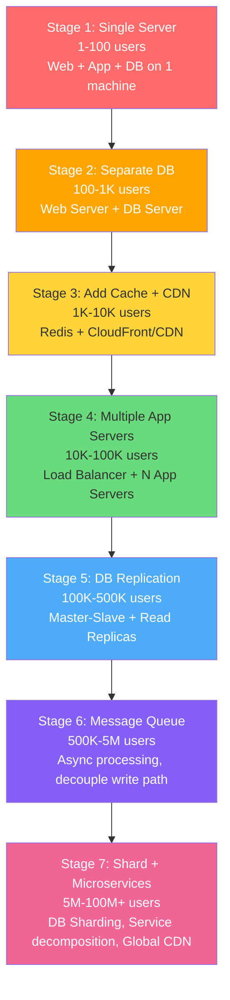
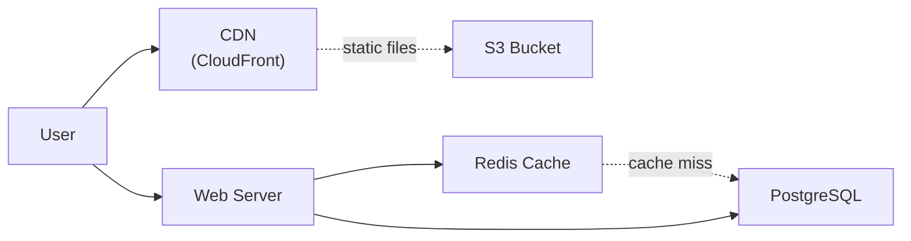
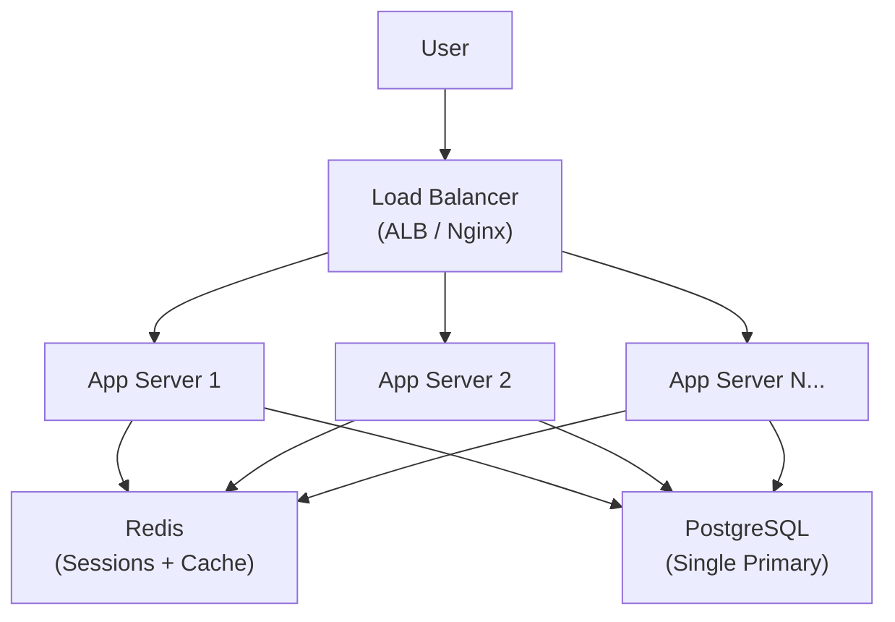
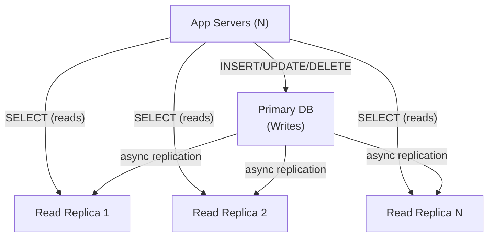
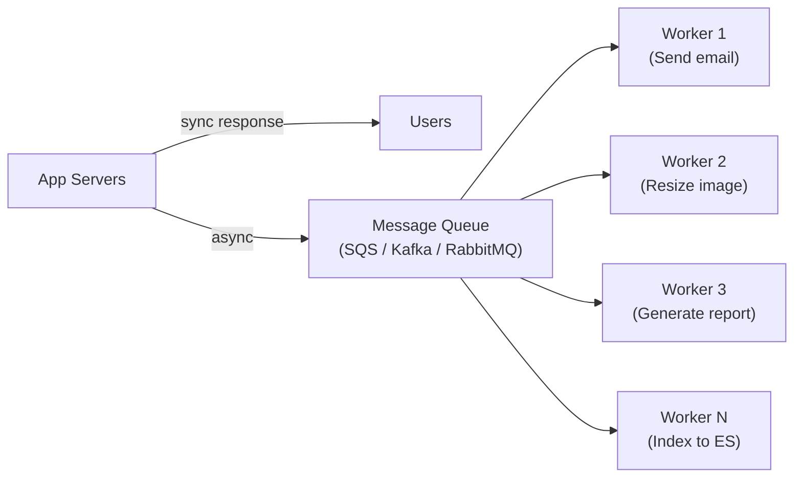

# 📈 Scaling From Zero to Millions — The Architecture Evolution Playbook

This is the most practical document in the entire roadmap. It walks through the **real progression** of how a system evolves from serving 1 user to 100 million users, what breaks at each stage, and the architectural changes required to survive.

The golden rule: **Don't over-engineer. Scale when the system tells you to, not when your ego tells you to.**

---

## The Evolution Roadmap



---

## Stage 1: Single Server (1 - 100 users)

Everything runs on one machine: web server, application code, database, file storage.

```
User → DNS → [Single Server: Nginx + Node.js + PostgreSQL + uploads/]
```

**What works:** Simple, cheap, fast to develop. Perfect for MVP.

**What breaks at ~100 users:**
- DB and app compete for CPU/RAM on the same machine
- One `ALTER TABLE` locks the DB → entire site goes down
- If the server crashes, everything is lost (SPOF — Single Point of Failure)
- No backups = data loss

**Metrics to watch:** CPU > 70%, RAM > 80%, Disk I/O wait > 20%

---

## Stage 2: Separate Database (100 - 1,000 users)

First architectural change: split the DB onto its own server.

```
User → [Web/App Server] → [Database Server (PostgreSQL)]
                        → [File Storage (S3)]
```

**Why:** Web server and DB have different scaling profiles. Web is CPU-bound (processing requests), DB is I/O-bound (disk reads). Separating them lets you size each independently.

**Also do:**
- Move file uploads to object storage (S3) — never store files on the app server
- Set up automated daily backups
- Add basic monitoring (CPU, memory, disk)

**What breaks at ~1,000 users:**
- DB becomes the bottleneck (every request hits the DB)
- Same queries get executed thousands of times for the same data
- Response time increases from 50ms to 500ms

---

## Stage 3: Add Cache Layer + CDN (1,000 - 10,000 users)



**Cache Layer (Redis/Memcached):**
- Cache the result of expensive DB queries
- **Cache-Aside pattern:** App checks Redis first → if miss, query DB → store in Redis with TTL
- Typical hit ratio: 80-95% → reduces DB load by 5-20x
- Session storage: Move sessions from app server memory to Redis → enables stateless app servers

**CDN (Content Delivery Network):**
- Serve static assets (images, CSS, JS) from edge nodes close to users
- Reduces latency from 200ms (origin) to 20ms (edge)
- Offloads 60-80% of bandwidth from your servers

**What breaks at ~10,000 users:**
- Single web server can't handle concurrent connections (Node.js: ~10K concurrent, but with DB wait it's lower)
- Single server failure = 100% downtime
- Deployment requires downtime

---

## Stage 4: Horizontal Scaling — Multiple App Servers (10,000 - 100,000 users)



### Horizontal vs Vertical Scaling

| | Vertical (Scale-Up) | Horizontal (Scale-Out) |
|---|---|---|
| **How** | Bigger machine (more CPU/RAM) | More machines |
| **Cost** | Exponential (2x CPU ≠ 2x price, often 4x) | Linear (2 servers ≈ 2x price) |
| **Limit** | Hardware ceiling (max ~128 cores, 4TB RAM) | Theoretically unlimited |
| **Downtime** | Usually requires restart | Zero-downtime with rolling deployment |
| **Complexity** | None | Need load balancer, stateless design, orchestration |

### Load Balancer Algorithms

| Algorithm | How It Works | Best For |
|-----------|-------------|----------|
| **Round Robin** | Rotate through servers sequentially | Equal-spec servers, stateless |
| **Least Connections** | Route to server with fewest active connections | Long-running requests, WebSocket |
| **IP Hash** | Hash client IP → consistent server | Session affinity (not recommended) |
| **Weighted Round Robin** | More traffic to bigger servers | Mixed-spec fleet |

### L4 vs L7 Load Balancing

| Layer | Decision Based On | Speed | Features |
|-------|-------------------|-------|----------|
| **L4 (Transport)** | TCP/UDP port, IP address | Fastest (~1μs) | No content inspection |
| **L7 (Application)** | HTTP headers, URL path, cookies | Slower (~5μs) | URL routing, SSL termination, caching, WAF |

**Rule:** Use L7 (ALB) for web traffic. Use L4 (NLB) for non-HTTP protocols (gRPC, MQTT, game servers).

### Stateless Server Design

**Critical requirement** for horizontal scaling: App servers must be **stateless** — no local sessions, no local file storage, no in-memory state.

Move everything external:
- Sessions → Redis
- File uploads → S3
- User-specific data → Database
- Real-time state → Redis Pub/Sub or WebSocket with Redis adapter

**What breaks at ~100,000 users:**
- Database is now the bottleneck. All N app servers hit 1 DB.
- Write-heavy workloads saturate the primary
- Read queries compete with writes for I/O

---

## Stage 5: Database Replication (100,000 - 500,000 users)



**Master-Slave (Primary-Replica) Replication:**
- **All writes** go to the Primary
- **All reads** are distributed across Replicas (N read replicas = N× read throughput)
- Replication is usually asynchronous → eventual consistency (50-500ms lag)

**The Replication Lag Problem:**
- User creates a post (write → Primary) → immediately refreshes (read → Replica) → post not visible yet!
- **Solution: Read-your-writes consistency** — After a write, route that user's reads to the Primary for a few seconds, then back to replicas.

**What breaks at ~500,000 users:**
- Write throughput hits ceiling (single Primary can do ~10K-50K writes/sec depending on hardware)
- Synchronous tasks block the request pipeline (sending email, generating PDF, resizing images)
- Peak traffic causes cascading timeouts

---

## Stage 6: Message Queues — Async Processing (500,000 - 5M users)



**Why Message Queues are a scaling superpower:**

1. **Decouple the write path:** API returns 202 Accepted immediately. Heavy work happens async via workers.
2. **Absorb traffic spikes:** During a 10× spike, the queue buffers messages. Workers process at steady pace.
3. **Independent scaling:** Scale workers independently from web servers. Need more email throughput? Add email workers.
4. **Failure isolation:** If the email service is down, messages wait in the queue. No user-facing errors.

**Your project uses this:** File upload → S3 → SQS → Lambda (chunk + index to Elasticsearch)

**Queue vs Stream:**
| | Message Queue (SQS, RabbitMQ) | Event Stream (Kafka, Kinesis) |
|---|---|---|
| **Delivery** | Each message consumed by 1 consumer | Each event consumed by all consumer groups |
| **Retention** | Deleted after processing | Retained for days/weeks (replayable) |
| **Ordering** | FIFO optional | Ordering within partition |
| **Use case** | Task distribution, work queue | Event sourcing, real-time analytics, audit log |

**What breaks at ~5M users:**
- Single database can't handle write volume even with replicas
- Table sizes exceed billions of rows → query performance degrades
- Single region can't serve global users with acceptable latency

---

## Stage 7: Sharding + Microservices + Global (5M - 100M+ users)

This is the final boss. At this scale, you need:

1. **Database Sharding** — Split data across multiple DB clusters (see [DATABASE-SCALING.md](./DATABASE-SCALING.md))
2. **Microservices** — Decompose monolith into independently scalable services (see [MICROSERVICES-VS-MONOLITH.md](./MICROSERVICES-VS-MONOLITH.md))
3. **Multi-Region Deployment** — Deploy to US, EU, Asia with data replication
4. **Global CDN + Edge Computing** — Cache API responses at edge, not just static files
5. **Comprehensive Observability** — Distributed tracing (Tempo), centralized logging (Loki), metrics (Prometheus)

---

## Back-of-the-Envelope Estimation

Every architect must estimate capacity before designing. Here's the framework:

### Traffic Estimation
```
Given: 10M Daily Active Users (DAU)
Assumption: Each user makes 20 requests/day on average

Total requests/day = 10M × 20 = 200M
QPS (Queries Per Second) = 200M / 86400 ≈ 2,300 QPS
Peak QPS (assume 3× average) = ~7,000 QPS
```

### Storage Estimation
```
Given: Each user generates 1KB of data per request
New data/day = 200M × 1KB = 200GB/day
Per year = 200GB × 365 = 73TB/year
With 3× replication = 219TB/year
```

### Memory Estimation (for caching)
```
Cache the top 20% of requests (80/20 rule)
Requests to cache = 200M × 0.2 = 40M
Cache size = 40M × 1KB = 40GB
→ A single Redis instance (max ~300GB RAM) handles this easily
```

### Bandwidth Estimation
```
Incoming: 200M × 1KB = 200GB/day = 2.3MB/s average, 7MB/s peak
Outgoing (assume 10KB response): 200M × 10KB = 2TB/day = 23MB/s average
→ A single 1Gbps NIC handles this (125MB/s capacity)
```

---

## Database Connection Pooling

A hidden scaling killer. Each database connection consumes ~10MB RAM on the DB server.

**Without pooling:**
```
50 app servers × 100 threads = 5,000 simultaneous DB connections
5,000 × 10MB = 50GB RAM just for connections!
PostgreSQL max_connections default = 100 → crashes immediately
```

**With connection pooling (PgBouncer / RDS Proxy):**
```
50 app servers → PgBouncer → 100 actual DB connections
App servers share pooled connections via transaction-level pooling
DB RAM for connections: 100 × 10MB = 1GB ✓
```

| Pooler | Best For | Mode |
|--------|----------|------|
| **PgBouncer** | PostgreSQL, self-managed | Transaction/Session/Statement pooling |
| **RDS Proxy** | AWS RDS/Aurora | Automatic, IAM auth, failover aware |
| **ProxySQL** | MySQL | Query routing, read/write splitting |
| **HikariCP** | JVM apps | In-process connection pool (not a proxy) |

---

## 🔥 Real Problems You WILL Encounter

### Problem 1: Connection Exhaustion
**Symptom:** `FATAL: too many connections for role "app"` at 2 AM during a traffic spike.
**Root cause:** No connection pooling. Each Lambda/container opens a new connection and never closes it.
**Solution:** PgBouncer in transaction mode, or RDS Proxy for serverless workloads. Set connection limits per application.

### Problem 2: Thundering Herd
**Symptom:** Cache key expires → 10,000 concurrent requests all hit the DB simultaneously → DB crashes.
**Root cause:** Popular cache key expiration at the same time.
**Solution:** 
- Add jitter to TTL: `TTL = base_ttl + random(0, 60 seconds)`
- Mutex lock: First request acquires a lock, fetches from DB, updates cache. Others wait or get stale data.
- Early refresh: Refresh cache when TTL < 20% remaining, before actual expiration.

### Problem 3: Cold Start After Deployment
**Symptom:** Deploy new version → all caches empty → DB gets hammered → response time spikes to 5s for 10 minutes.
**Solution:** Cache warming — preload hot keys before directing traffic. Blue-green deployment: warm caches on green environment before switching.

### Problem 4: Hot Partition / Hot Key
**Symptom:** One DB shard or cache node gets 100× more traffic than others (celebrity user, viral post).
**Solution:** Key-level sharding (add random suffix to spread across nodes), local in-process cache for hot keys, or dedicated isolated infrastructure for VIP entities.

### Problem 5: Cascading Failure
**Symptom:** Payment service is slow (2s timeout) → App server threads all blocked waiting → App server can't serve ANY requests → Users see 502 everywhere.
**Solution:** Circuit breaker (see [RESILIENCY-PATTERNS.md](./RESILIENCY-PATTERNS.md)), bulkhead pattern (separate thread pools per downstream), timeout at every boundary.

### Problem 6: Stateful Server Trap
**Symptom:** Add 3rd app server → some users lose their sessions → support tickets flood in.
**Root cause:** Sessions stored in app server memory. New server has no sessions.
**Solution:** Externalize ALL state to Redis/DB. App servers must be completely stateless and disposable.

### Problem 7: Queue Backlog During Outage
**Symptom:** Worker crashes for 2 hours → 500K messages pile up in SQS → after restart, workers take 6 hours to catch up → users complain about delayed notifications.
**Solution:** Auto-scale workers based on queue depth (`ApproximateNumberOfMessages` metric). Set DLQ for poison messages. Prioritize recent messages over old ones (use message deduplication or TTL).

---

## 📍 Case Study — Answer & Discussion

> **Q:** The application crashes at 8 PM every day due to a 10x traffic spike. Based on a 100% Database CPU chart, what component would you scale first?

### Analysis

**The symptom:** DB CPU at 100% during peak hours. This means the database is the bottleneck, not the application servers.

### Step-by-Step Solution

**Step 1 (Immediate — 30 minutes): Identify the expensive queries**
```sql
-- PostgreSQL: Find slow queries
SELECT query, calls, mean_exec_time, total_exec_time 
FROM pg_stat_statements 
ORDER BY total_exec_time DESC 
LIMIT 10;
```
Often, 1-2 unoptimized queries cause 80% of the load (missing index, full table scan, N+1 query).

**Step 2 (Short-term — same day): Add caching**
- Cache the most-queried data in Redis with 60-second TTL
- For a read-heavy workload (typical web app is 90% reads), this alone can reduce DB load by 80%

**Step 3 (Medium-term — 1 week): Add read replicas**
- Route all `SELECT` queries to read replicas
- Keep `INSERT/UPDATE/DELETE` on the primary
- 2 read replicas → 3× read throughput

**Step 4 (If reads aren't the problem — writes are): Message queue**
- Move write-heavy operations (logging, analytics, notifications) to async via SQS
- DB only handles critical transactional writes synchronously

**Step 5 (Long-term): Pre-scaling based on schedule**
- If the spike is predictable (8 PM daily), schedule ASG to scale OUT at 7:30 PM
- AWS Aurora: Enable auto-scaling for read replicas based on CPU metric

### What NOT to do
- ❌ Don't vertically scale first (expensive, temporary fix, requires downtime)
- ❌ Don't add more app servers (the bottleneck is the DB, not the app)
- ❌ Don't shard immediately (massive complexity for a predictable traffic pattern)
