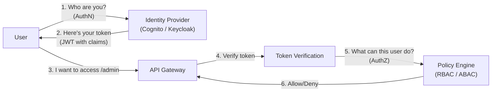
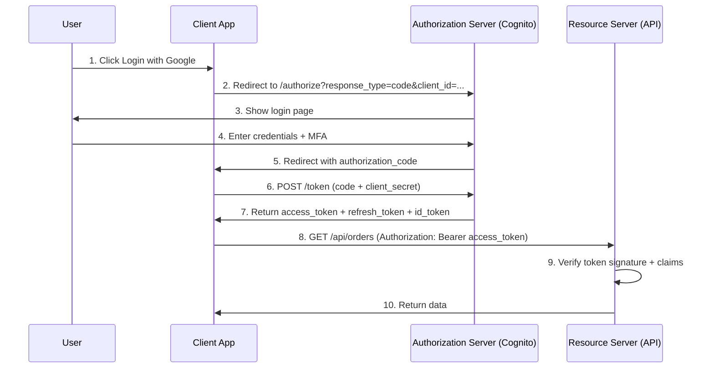
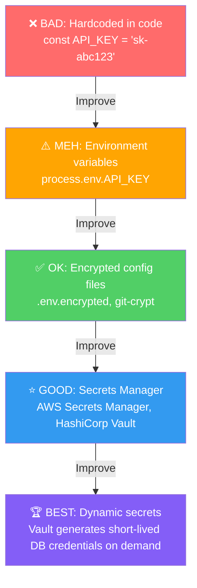
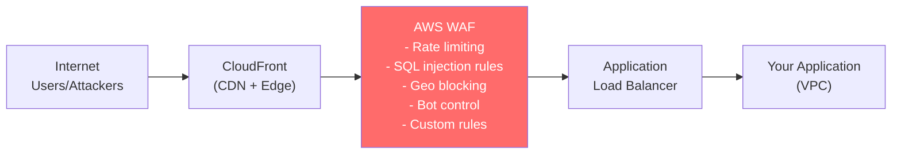
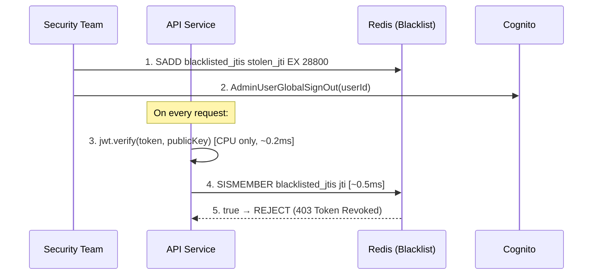

# 🔐 Core Security & Authentication Architecture

Security is not a feature — it's a **continuous process** baked into every layer of the system. As an architect, you must design for defense-in-depth: multiple overlapping security controls where any single layer failing doesn't compromise the system.

> "Security at the speed of business" — the goal is making the secure path the easiest path for developers.

---

## 1. Identity, Authentication & Authorization — The Trifecta



| Concept | Question | Example | Layer |
|---------|----------|---------|-------|
| **Identity** | Who is this entity? | user_id: `u-12345`, email: `john@corp.com` | Data |
| **Authentication (AuthN)** | Can you prove you are who you claim? | Password + MFA, Certificate, Biometric | Verification |
| **Authorization (AuthZ)** | What are you allowed to do? | Role: `admin` → can access `/admin/*` | Policy |

### Multi-Factor Authentication (MFA)

| Factor | What | Example |
|--------|------|---------|
| **Something you know** | Password, PIN | Password `P@ssw0rd!` |
| **Something you have** | Physical device | TOTP app (Google Authenticator), hardware key (YubiKey) |
| **Something you are** | Biometric | Fingerprint, Face ID |

**Architect's Rule:** Always require MFA for:
- Admin/privileged accounts (non-negotiable)
- Access to production systems
- Financial transactions above threshold
- Password resets / account recovery

---

## 2. OAuth 2.0, OpenID Connect & SSO

### OAuth 2.0 — Delegated Authorization

OAuth 2.0 is an **authorization** framework (NOT authentication). It answers: "Can this app access my data?"



### OAuth 2.0 Grant Types

| Grant Type | When to Use | Security Level |
|-----------|------------|---------------|
| **Authorization Code + PKCE** | SPA, Mobile apps, any public client | ⭐⭐⭐⭐⭐ (recommended) |
| **Authorization Code** | Server-side web apps (confidential client) | ⭐⭐⭐⭐ |
| **Client Credentials** | Machine-to-machine (service accounts) | ⭐⭐⭐⭐ |
| **Device Code** | Smart TV, CLI tools (no browser) | ⭐⭐⭐ |
| ~~Implicit~~ | **DEPRECATED** — use Code + PKCE instead | ❌ |
| ~~Password~~ | **DEPRECATED** — never use | ❌ |

### OpenID Connect (OIDC) — Authentication on Top of OAuth

| | OAuth 2.0 | OIDC |
|---|---|---|
| **Purpose** | Authorization (delegated access) | Authentication (identity verification) |
| **Returns** | `access_token` (opaque or JWT) | `id_token` (always JWT) + `access_token` |
| **User info** | Not standardized | Standardized claims (sub, email, name, picture) |
| **Discovery** | No | `/.well-known/openid-configuration` endpoint |

### SSO & Federation

| Pattern | How | Use Case |
|---------|-----|----------|
| **SAML 2.0** | XML-based, enterprise IdPs | Corporate SSO (Azure AD, Okta) |
| **OIDC Federation** | JSON-based, modern IdPs | Social login (Google, GitHub), B2C |
| **AWS Cognito User Pools** | Managed OIDC provider | Your app's own user management |
| **AWS Cognito Identity Pools** | Federated access to AWS services | Give authenticated users temporary AWS credentials |

---

## 3. JWT (JSON Web Tokens) — Deep Dive

### JWT Structure

```
eyJhbGciOiJSUzI1NiJ9.eyJzdWIiOiJ1LTEyMyIsInJvbGUiOiJhZG1pbiIsImV4cCI6MTcxMH0.signature
│── Header ──│           │── Payload (Claims) ──│                       │── Signature ──│
```

**Header:** Algorithm (RS256, ES256) + Token Type (JWT)
**Payload:** Claims (sub, iat, exp, iss, aud, custom claims like role)
**Signature:** `SIGN(header.payload, private_key)` — ensures integrity

### JWT vs Opaque Tokens

| | JWT (Self-contained) | Opaque Token |
|---|---|---|
| **Verification** | Verify signature locally (no DB/API call) | Must call Authorization Server to validate |
| **Performance** | ⭐⭐⭐⭐⭐ (no network call) | ⭐⭐⭐ (network call per request) |
| **Revocation** | ❌ Hard (token is self-contained, valid until exp) | ✅ Easy (delete from server-side store) |
| **Size** | 500-2000 bytes (contains claims) | 32-64 bytes (just a reference) |
| **Info leakage** | Claims visible if decoded (not encrypted by default) | No info exposure |
| **Best for** | Microservices (avoid central token verification bottleneck) | Monoliths, high-security environments |

### The JWT Revocation Problem

**The Problem:** JWT is stateless. Once issued, it's valid until expiration. If a token is stolen, you can't "un-sign" it.

**Solutions (ordered by recommendation):**

1. **Short-lived Access Token + Refresh Token** (Recommended)
   ```
   Access Token: 5-15 minutes expiry
   Refresh Token: 7-30 days expiry (stored in HTTP-only secure cookie)
   
   Flow:
   1. Access token expires → client uses refresh token to get new access token
   2. To revoke: invalidate the refresh token in DB
   3. Worst case: stolen access token works for max 15 minutes
   ```

2. **Token Blacklist in Cache** (For immediate revocation)
   ```
   On revoke: 
     ADD token_jti to Redis SET "blacklisted_tokens" with TTL = token's remaining lifetime
   
   On verify:
     1. jwt.verify(token, public_key)  ← still O(1), CPU only
     2. redis.sismember("blacklisted_tokens", token.jti)  ← O(1), ~0.5ms
   
   Blacklist size: Only compromised tokens (tiny), NOT all tokens
   ```

3. **Token Versioning** (Per-user revocation)
   ```
   User table: { user_id: "u-123", token_version: 5 }
   JWT claim: { sub: "u-123", token_version: 5 }
   
   On verify: if jwt.token_version !== db.token_version → REJECT
   On revoke: INCREMENT user.token_version → all existing tokens invalid
   ```

### JWT Security Best Practices

| Practice | Why |
|----------|-----|
| Use **RS256/ES256** (asymmetric), NOT HS256 | Asymmetric: only Auth Server has private key. Services verify with public key. HS256: shared secret → any service can forge tokens |
| Set short **exp** (5-15 min) | Limits damage window of stolen tokens |
| Validate **iss** (issuer) and **aud** (audience) | Prevents token from one app being used in another |
| Store tokens in **HTTP-only, Secure, SameSite** cookies | Prevents XSS from accessing tokens (no JavaScript access) |
| Never put sensitive data in JWT payload | JWT is Base64-encoded, NOT encrypted. Anyone can decode the payload |
| Use **jti** (JWT ID) claim | Enables token blacklisting and prevents replay attacks |

---

## 4. Authorization Models — RBAC vs ABAC vs ReBAC

### RBAC (Role-Based Access Control)

```
User → Role → Permission

Example:
  User "Alice" → Role "Editor" → Permissions ["read", "write", "publish"]
  User "Bob"   → Role "Viewer" → Permissions ["read"]
```

**Pros:** Simple, widely understood, easy to audit
**Cons:** Role explosion (admin-east, admin-west, admin-finance, ...), can't handle fine-grained context

### ABAC (Attribute-Based Access Control)

```
Policy: ALLOW if
  subject.department == "engineering" AND
  resource.classification != "top-secret" AND
  environment.time BETWEEN "09:00" AND "18:00" AND
  subject.clearance_level >= resource.required_clearance
```

**Pros:** Fine-grained, context-aware (time, location, risk score)
**Cons:** Complex policies, hard to audit, harder to debug "why was I denied?"

### ReBAC (Relationship-Based Access Control)

```
Google Docs model:
  "Alice" is "editor" of "document_123"
  "Bob" is "viewer" of "folder_456"
  "document_123" is "child" of "folder_456"
  → Bob can view document_123 (inherited from folder)

Tools: Google Zanzibar, SpiceDB, Ory Keto, Auth0 FGA
```

**Pros:** Models real-world relationships, handles inheritance naturally
**Cons:** Complex graph traversal, eventual consistency in permission checks

### Decision Guide

| Criteria | RBAC | ABAC | ReBAC |
|----------|------|------|-------|
| **Team size** | Any | Large | Large |
| **Access patterns** | Role-based ("admins can delete") | Context-based ("only during business hours") | Relationship-based ("owner of document") |
| **Complexity** | Low | High | Medium-High |
| **Audit** | Easy | Hard | Medium |
| **Best for** | Internal tools, APIs, admin panels | Healthcare, finance, government | Document sharing, social platforms, multi-tenant SaaS |
| **Implementation** | Database table: user_roles | Policy engine (OPA, Cedar) | Graph database (SpiceDB, Zanzibar) |

---

## 5. Secrets Management

**Rule #1:** Never store secrets in code, environment variables, or config files.

### Secrets Hierarchy



### AWS Secrets Management Options

| Service | Use Case | Rotation | Cost |
|---------|----------|----------|------|
| **AWS Secrets Manager** | Database credentials, API keys, certificates | Automatic rotation with Lambda | $0.40/secret/month |
| **AWS Systems Manager Parameter Store** | Configuration values, non-critical secrets | Manual or EventBridge | Free (standard), $0.05/10K API calls (advanced) |
| **AWS KMS** | Encryption keys for S3, EBS, RDS, custom encryption | Automatic annual rotation | $1/key/month + API calls |
| **HashiCorp Vault** | Multi-cloud, dynamic secrets, complex policies | Built-in, any backend | Self-hosted or HCP |

### Secret Rotation Pattern

```
1. Lambda trigger (scheduled every 30 days)
2. Generate new DB password
3. Update Secrets Manager with new password
4. Update DB user password (RDS API)
5. Applications fetch new secret on next request (cached for 5 min)
6. Old password grace period (24h) → then disabled
```

---

## 6. API Security & OWASP Top 10

### OWASP Top 10 (2021) — What Architects Must Know

| # | Vulnerability | Architect's Control |
|---|--------------|-------------------|
| A01 | **Broken Access Control** | RBAC/ABAC enforcement at API Gateway + Service level. Never trust client-side checks only |
| A02 | **Cryptographic Failures** | TLS 1.2+ everywhere, AES-256 at rest, KMS key management |
| A03 | **Injection** (SQL, NoSQL, LDAP) | Parameterized queries, ORM, input validation at boundary |
| A04 | **Insecure Design** | Threat modeling (STRIDE), security requirements in ADRs |
| A05 | **Security Misconfiguration** | Infrastructure as Code, security scanning in CI, no default credentials |
| A06 | **Vulnerable Components** | Dependabot/Renovate, SCA scanning (Snyk), SBOM |
| A07 | **Authentication Failures** | MFA, account lockout, credential stuffing protection (rate limiting) |
| A08 | **Software/Data Integrity** | Signed artifacts, verified CI/CD pipelines, SRI for CDN assets |
| A09 | **Logging & Monitoring Failures** | Centralized logging (ELK/Loki), anomaly detection, audit trail |
| A10 | **SSRF** (Server-Side Request Forgery) | Allowlist outbound destinations, IMDSv2, no user-controlled URLs |

### API Security Checklist

```
Authentication:
  ✅ OAuth 2.0 / OIDC for user authentication
  ✅ API keys + request signing for machine-to-machine
  ✅ MTLS for internal service-to-service

Rate Limiting:
  ✅ Per-user rate limits (Token Bucket: 100 req/min)
  ✅ Per-IP rate limits (protect against DDoS)
  ✅ Per-endpoint rate limits (expensive endpoints get lower limits)

Input Validation:
  ✅ Validate at API boundary (Joi, Zod, class-validator in NestJS)
  ✅ Reject unknown fields (allowUnknown: false)
  ✅ Max request body size (1MB default, configurable per endpoint)

Transport:
  ✅ TLS 1.2+ everywhere (no exceptions)
  ✅ HSTS header (force HTTPS)
  ✅ Certificate pinning for mobile apps

Headers:
  ✅ Content-Security-Policy (prevent XSS)
  ✅ X-Content-Type-Options: nosniff
  ✅ X-Frame-Options: DENY (prevent clickjacking)
  ✅ Referrer-Policy: strict-origin-when-cross-origin
```

### AWS WAF Integration



---

## 7. Supply Chain Security

Modern applications have **hundreds of dependencies**. Each is a potential attack vector.

| Attack Vector | Real Incident | Prevention |
|--------------|---------------|-----------|
| **Malicious package** | `event-stream` npm package compromised (2018) — Bitcoin wallet theft | Lockfile pinning, audit, Snyk |
| **Typosquatting** | `crossenv` (malicious) vs `cross-env` (legitimate) | Package name verification, `npm audit` |
| **Compromised maintainer** | `ua-parser-js` hijacked (2021) — crypto miners | Dependabot alerts, SBOM, minimal dependencies |
| **CI/CD pipeline poisoning** | SolarWinds attack (2020) — build process compromised | Signed artifacts, verified pipelines, SLSA framework |
| **Container image vulnerabilities** | Base image with known CVEs | Trivy/Grype scanning, minimal base images (distroless) |

### Defense Strategy

```
1. SBOM (Software Bill of Materials): Know what's in your software
2. Dependency scanning: Snyk, Dependabot, npm audit in CI
3. Lock files: Always commit pnpm-lock.yaml / package-lock.json
4. Minimal dependencies: Do you really need left-pad?
5. Container scanning: Trivy in CI pipeline, distroless base images
6. Signed commits & artifacts: GPG-signed commits, cosign for containers
7. SLSA framework: Provenance attestation for builds
```

---

## 🔥 Real Security Incidents & Lessons

### Incident 1: JWT Secret Key Leaked in GitHub
**What happened:** Developer committed `.env` file with `JWT_SECRET=mysecretkey123` to public repo. Attacker found it, forged admin tokens.
**Root cause:** No `.gitignore` for env files, symmetric HS256 (shared secret can sign AND verify).
**Fix:** Switch to RS256 (asymmetric), use AWS Secrets Manager for keys, add pre-commit hooks to detect secrets (git-secrets, TruffleHog).

### Incident 2: Mass Account Takeover via Password Stuffing
**What happened:** Attacker used a leaked credential database (from another site) to try login on our API. 50,000 accounts compromised in 2 hours.
**Root cause:** No rate limiting on `/auth/login`, no detection of credential stuffing patterns, many users reused passwords.
**Fix:** Rate limiting (5 attempts/minute per IP), CAPTCHA after 3 failed attempts, notify users of suspicious login (new device/location), require MFA for sensitive accounts.

### Incident 3: SSRF via File Upload URL
**What happened:** File processor accepted a user-provided URL for "import from URL" feature. Attacker submitted `http://169.254.169.254/latest/meta-data/iam/security-credentials/` → got AWS IAM credentials from EC2 metadata service.
**Root cause:** No URL validation, IMDS v1 (no token required).
**Fix:** Allowlist domains for URL imports, switch to IMDSv2 (requires token), use VPC endpoints instead of public endpoints, run workloads with minimal IAM permissions.

### Incident 4: Privilege Escalation via Direct Object Reference
**What happened:** User changed `GET /api/orders/123` to `GET /api/orders/456` and accessed another user's order. No ownership check.
**Root cause:** API only checked "is user authenticated?" but not "does this user own this resource?"
**Fix:** Always enforce ownership checks: `WHERE order.user_id = currentUser.id`. Use ABAC policies for complex cases. Never rely on "security through obscurity" (UUIDs are NOT access control).

### Incident 5: Supply Chain Attack via npm Package
**What happened:** Dependency `colors` v1.4.1 was updated by its author to v1.4.44-liberty-2, which introduced an infinite loop crashing Node.js apps.
**Root cause:** No lockfile pinning, auto-updating to latest minor version.
**Fix:** Always use exact versions or lockfiles, review dependency updates before merging (Renovate with auto-merge disabled for major/minor), minimize dependencies.

---

## 📍 Case Study Answer

> **Scenario:** Your system detects a hacker has stolen an active Admin Token. The token is a JWT issued by Cognito, valid for 8 more hours, completely stateless. Design an immediate Access Revocation mechanism without degrading performance.

### Solution Architecture



### Implementation

```typescript
// middleware/token-blacklist.guard.ts
@Injectable()
export class TokenBlacklistGuard implements CanActivate {
  constructor(private readonly redis: RedisService) {}

  async canActivate(context: ExecutionContext): Promise<boolean> {
    const request = context.switchToHttp().getRequest();
    const token = extractToken(request);
    
    // Step 1: Verify JWT signature + expiry (CPU only, no network)
    const payload = jwt.verify(token, publicKey);
    
    // Step 2: Check blacklist (Redis, ~0.5ms)
    const isBlacklisted = await this.redis.sismember(
      'blacklisted_jtis',
      payload.jti
    );
    
    if (isBlacklisted) {
      throw new ForbiddenException('Token has been revoked');
    }
    
    return true;
  }
}
```

### Why This Doesn't Degrade Performance

| Before (normal) | After (with blacklist) | Overhead |
|-----------------|----------------------|----------|
| `jwt.verify()` — 0.2ms CPU | `jwt.verify()` — 0.2ms CPU | 0 |
| — | `redis.sismember()` — 0.5ms network | +0.5ms |
| Total: 0.2ms | Total: 0.7ms | **+0.5ms (negligible)** |

**Why it works:**
1. Redis `SISMEMBER` is O(1) regardless of set size
2. Blacklist only contains compromised tokens (tiny set, not all tokens)
3. TTL on blacklist entries = token's remaining lifetime → automatic cleanup
4. No change to the normal JWT verification flow for 99.99% of requests
5. Combined with `AdminUserGlobalSignOut` → Cognito invalidates all refresh tokens → attacker can't get new access tokens
