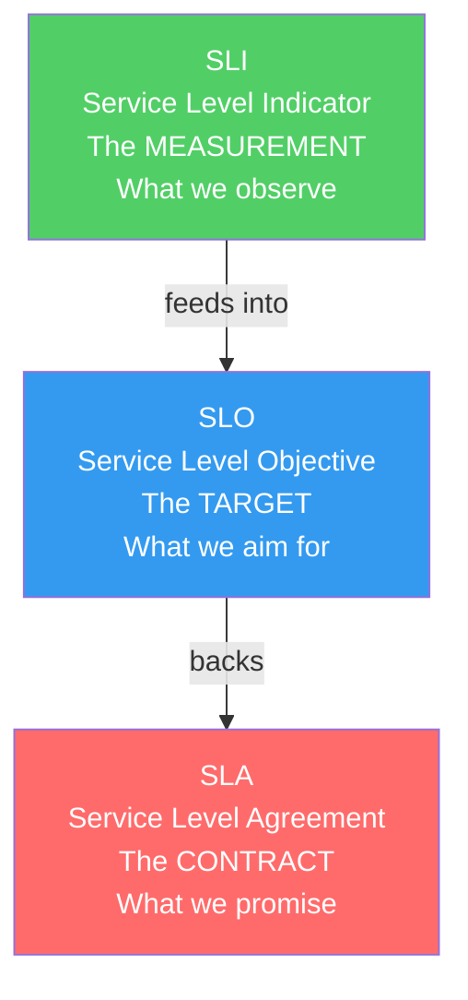
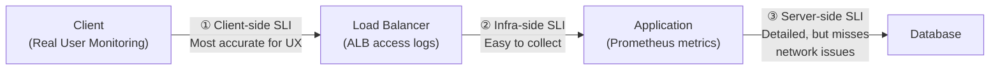
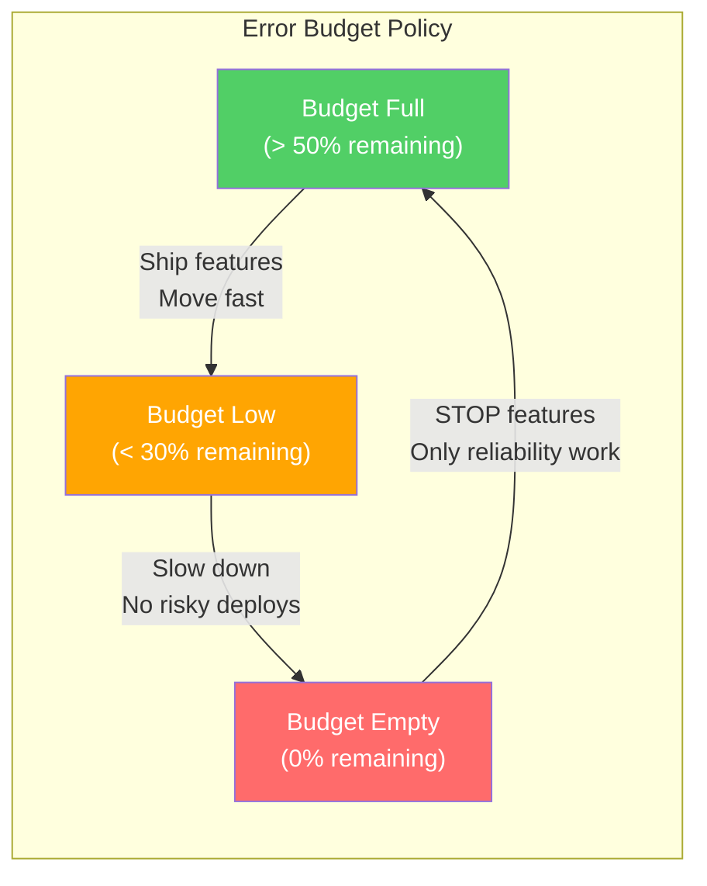

# 📊 SLA, SLO & SLI — Reliability Engineering

Understanding SLAs, SLOs, and SLIs is what separates a "feature developer" from a **production-minded architect**. These metrics define the contract between your system and its users, and they drive every architectural decision about redundancy, failover, and investment.

> "Hope is not a strategy." — Google SRE Book

---

## 1. The Three Pillars



| | SLI | SLO | SLA |
|---|---|---|---|
| **What** | A quantitative metric of service behavior | A target value/range for an SLI | A formal contract with consequences |
| **Who defines** | Engineering team | Engineering + Product | Business + Legal + Customer |
| **Example** | "P99 latency = 230ms" | "P99 latency < 300ms" | "If P99 > 500ms for >1% of month, 10% credit" |
| **If violated** | Data point — investigate | Alert → prioritize fix over features | Financial penalty, customer churn |

---

## 2. SLIs — What to Measure

### The Four Golden Signals (Google SRE)

| Signal | What | SLI Example |
|--------|------|-------------|
| **Latency** | How long requests take | P50 = 50ms, P95 = 200ms, P99 = 500ms |
| **Traffic** | Demand on the system | 1,500 requests/second |
| **Errors** | Rate of failed requests | 0.1% of requests return 5xx |
| **Saturation** | How full the system is | CPU at 75%, memory at 60%, DB connections at 80% |

### Choosing Good SLIs

| Service Type | Primary SLI | How to Measure |
|-------------|-------------|----------------|
| **API/Web** | Availability + Latency | % of requests returning 2xx within 300ms |
| **Data pipeline** | Freshness + Correctness | Time from event to indexed (< 5 min), % records processed correctly |
| **Storage** | Durability + Availability | % of objects retrievable, uptime percentage |
| **Batch job** | Completion + Timeliness | % of jobs completing within expected window |

### SLI Measurement Points



**Best practice:** Measure SLIs from the **client's perspective** (or as close to it as possible). ALB access logs or CloudFront logs give a more accurate picture than application metrics alone.

---

## 3. SLOs — Setting Targets

### The Error Budget Concept

```
If SLO = 99.9% availability:
  Total minutes in month: 30 × 24 × 60 = 43,200 minutes
  Error budget: 0.1% × 43,200 = 43.2 minutes of downtime allowed

  Month starts:  [███████████████████████████████] 43.2 min budget
  After outage:  [█████████████████░░░░░░░░░░░░░░] 15 min remaining
  Budget spent:  ← Freeze feature work, focus on reliability →
```



### The Nines Table — What Each Level Really Means

| Availability | Annual Downtime | Monthly Downtime | Cost Implication |
|-------------|----------------|-----------------|-----------------|
| 99% (two nines) | 3.65 days | 7.3 hours | Basic infra, no redundancy |
| 99.9% (three nines) | 8.77 hours | 43.8 minutes | Load balancer + auto-restart |
| 99.95% | 4.38 hours | 21.9 minutes | Multi-AZ deployment |
| 99.99% (four nines) | 52.6 minutes | 4.38 minutes | Multi-AZ + auto-failover + health checks |
| 99.999% (five nines) | 5.26 minutes | 26.3 seconds | Multi-region active-active |

**Critical insight:** Each additional "nine" is ~10x more expensive. Going from 99.9% to 99.99% might require:
- Multi-AZ database with automatic failover (~2x DB cost)
- Health checks + auto-healing infrastructure
- Zero-downtime deployments (blue/green or canary)
- On-call rotation for sub-5-minute response time

### Setting Realistic SLOs

| Principle | Example |
|-----------|---------|
| **Start with what you measure today** | If current P99 latency is 800ms, don't set SLO at 100ms |
| **SLO < SLA** (always leave a buffer) | SLA promises 99.9% → internal SLO should be 99.95% |
| **Not every service needs the same SLO** | Payment API: 99.99%, Internal dashboard: 99.5% |
| **Iterate** | Start conservative, tighten as you improve |
| **Include all dependencies in calculation** | Your service's availability ≤ MIN(all dependencies' availability) |

### Composite Availability

```
Your service depends on: ALB (99.99%) + ECS (99.99%) + RDS (99.95%) + S3 (99.999%)

Composite = 99.99% × 99.99% × 99.95% × 99.999% = 99.93%

→ Your BEST possible SLO is ~99.93%
→ Even if your code is perfect, AWS dependencies limit you
→ To achieve 99.99%, you need redundancy at every layer
```

---

## 4. SLAs — The Business Contract

### SLA Structure

```
SLA for "File Processing API":

1. Availability: 99.9% measured monthly
   - Measurement: % of 1-minute intervals with successful health checks
   - Exclusions: Scheduled maintenance (announced 48h in advance)
   
2. Latency: P95 < 500ms for GET /api/documents
   - Measurement: ALB access logs, aggregated monthly
   
3. Penalties:
   | Availability     | Credit        |
   |-----------------|---------------|
   | 99.0% - 99.9%  | 10% monthly   |
   | 95.0% - 99.0%  | 25% monthly   |
   | Below 95.0%    | 50% monthly   |
   
4. Support Response:
   | Severity | Response Time | Resolution Time |
   |----------|--------------|-----------------|
   | Critical | 15 minutes   | 4 hours         |
   | High     | 1 hour       | 8 hours         |
   | Medium   | 4 hours      | 3 business days |
```

### AWS SLA Examples

| Service | SLA | Credit |
|---------|-----|--------|
| **EC2** | 99.99% (region) | 10% if < 99.99%, 30% if < 99.0% |
| **S3** | 99.9% availability, 99.999999999% durability | 10% if < 99.9% |
| **RDS Multi-AZ** | 99.95% | 10% if < 99.95% |
| **Lambda** | 99.95% | 10% if < 99.95% |
| **DynamoDB** | 99.999% (Global Tables) | 10% if < 99.999% |

**Important:** AWS SLA credits are typically 10-30% of the failed service's monthly bill — NOT your total business loss. If a 1-hour outage costs you $50,000 in lost revenue, the AWS credit might be $50. **Your DR strategy must not depend on AWS SLA credits.**

---

## 5. Implementing SLI/SLO Monitoring

### Prometheus + Grafana Stack

```yaml
# Prometheus recording rule: Calculate availability SLI
groups:
  - name: sli_rules
    rules:
      # Availability: % of successful requests
      - record: sli:availability:ratio_rate5m
        expr: |
          sum(rate(http_requests_total{code!~"5.."}[5m]))
          /
          sum(rate(http_requests_total[5m]))
      
      # Latency: P99 latency
      - record: sli:latency:p99_5m
        expr: |
          histogram_quantile(0.99, 
            sum(rate(http_request_duration_seconds_bucket[5m])) by (le)
          )

# Alerting rules: SLO burn rate alerts
  - name: slo_alerts
    rules:
      # Fast burn: 2% of monthly budget in 1 hour → page
      - alert: HighErrorBurnRate
        expr: |
          1 - sli:availability:ratio_rate1h < 0.999 * (1 - 0.028)
        for: 5m
        labels:
          severity: critical
        annotations:
          summary: "Burning through error budget at 28x rate"
      
      # Slow burn: 5% of monthly budget in 6 hours → ticket
      - alert: SlowErrorBurnRate
        expr: |
          1 - sli:availability:ratio_rate6h < 0.999 * (1 - 0.083)
        for: 30m
        labels:
          severity: warning
```

### SLO Burn Rate Alerting

Instead of alerting on every error, alert based on how fast you're consuming your error budget:

| Alert | Condition | Action | Window |
|-------|-----------|--------|--------|
| **Page (critical)** | Consuming 14.4x of budget rate | Wake someone up | 1 hour |
| **Ticket (warning)** | Consuming 6x of budget rate | Fix within business hours | 6 hours |
| **Low priority** | Consuming 3x of budget rate | Address this sprint | 3 days |

**Why this is better than threshold alerts:**
- "5xx > 10/minute" fires too often (might be normal)
- "Error budget burn rate > 14x" only fires when you're in real danger
- Fewer false alarms → less alert fatigue → faster response to real incidents

### Grafana SLO Dashboard

```
┌─────────────────────────────────────────────────┐
│ File Processing API - SLO Dashboard              │
├─────────────────────────────────────────────────┤
│                                                   │
│  Availability SLO: 99.9%          Current: 99.94% │
│  ████████████████████████████░░  Budget: 67% left │
│                                                   │
│  Latency SLO: P99 < 500ms        Current: 320ms  │
│  ██████████████████████████████  Budget: 90% left │
│                                                   │
│  Error Budget Remaining: 28.6 minutes             │
│  Days left in month: 18                           │
│  Burn rate: 0.8x (healthy)                        │
│                                                   │
│  [Availability over time chart]                   │
│  [Latency percentiles chart: P50, P95, P99]       │
│  [Error budget consumption chart]                 │
│                                                   │
└─────────────────────────────────────────────────┘
```

---

## 6. Incident Management & Blameless Postmortems

### Incident Severity Levels

| Level | Definition | Response | Example |
|-------|-----------|----------|---------|
| **SEV1** | Complete service outage, data loss risk | All-hands, exec notification | All APIs return 500 |
| **SEV2** | Major feature degraded, significant user impact | On-call team + escalation | Search not working, upload fails |
| **SEV3** | Minor feature degraded, workaround exists | On-call team | Slow performance, intermittent errors |
| **SEV4** | No user impact, monitoring anomaly | Next business day | Elevated error rate, not affecting SLO |

### Blameless Postmortem Template

```markdown
# Incident Postmortem: [Title]

## Summary
- **Date:** 2025-01-15
- **Duration:** 47 minutes (09:13 - 10:00 UTC)
- **Severity:** SEV2
- **Impact:** 30% of file uploads failed, affecting ~500 users
- **Error budget consumed:** 12% of monthly budget

## Timeline
- 09:13 - Monitoring alert: 5xx rate > 5% (PagerDuty triggered)
- 09:18 - On-call engineer acknowledges, begins investigation
- 09:25 - Root cause identified: SQS queue backed up due to Lambda concurrency limit
- 09:32 - Mitigation: Increased Lambda reserved concurrency from 10 to 100
- 09:45 - Queue draining, error rate declining
- 10:00 - All systems nominal, incident resolved

## Root Cause
Lambda function processing SQS messages hit the reserved concurrency limit (10).
New messages accumulated in SQS faster than Lambda could process them.
After visibility timeout (30 seconds), messages became visible again → 
duplicate processing → more Lambda invocations → exceeded limit → throttling.

## What Went Well
- Alert fired within 2 minutes of issue starting
- On-call responded within 5 minutes
- Root cause identified quickly (good dashboards)

## What Went Wrong  
- Lambda concurrency limit was set during development (10) and never updated for production
- No alert on SQS queue depth (would have caught this earlier)
- No documentation on expected Lambda concurrency needs

## Action Items
| Action | Owner | Priority | Due |
|--------|-------|----------|-----|
| Increase Lambda concurrency limit + add auto-scaling | @engineer-a | P1 | Jan 17 |
| Add SQS queue depth alarm (threshold: 1000) | @engineer-b | P1 | Jan 17 |
| Add Lambda throttle alarm | @engineer-b | P1 | Jan 17 |
| Document expected concurrency per environment | @architect | P2 | Jan 24 |
| Add load test for queue processing | @engineer-a | P2 | Feb 1 |

## Lessons Learned
Development configuration left in production is a recurring issue.
→ Add environment-specific configuration checklist to deployment pipeline.
```

---

## 🔥 Real SLO Problems

### Problem 1: "100% Availability" SLO
**What happened:** CEO told customers "we guarantee 100% uptime." Engineering knows this is impossible. Every deployment, every dependency failure, every DNS propagation causes some downtime.
**Fix:** Educate stakeholders: 100% is mathematically impossible and infinitely expensive. Negotiate 99.99% with automated failover. Document that even AWS doesn't guarantee 100%.

### Problem 2: Measuring Availability Wrong
**What happened:** Team reported 99.99% availability based on health check endpoint (`/health` returns 200). But actual user-facing endpoints were returning 500 errors because the database was overloaded. Health check passed because it didn't check DB.
**Fix:** SLI must measure **real user impact**, not synthetic health checks. Use ALB access log analysis: `successful_requests / total_requests`. Deep health checks must verify all critical dependencies.

### Problem 3: SLO Without Error Budget Policy
**What happened:** Team set SLO at 99.9% but kept shipping features even when error budget was exhausted. SLO became meaningless — just a number on a dashboard nobody looked at.
**Fix:** Error budget policy: When budget < 30%, freeze risky deployments. When budget = 0%, stop all feature work until reliability improves. Get VP Engineering sign-off on the policy.

### Problem 4: Alerting on Every Error Instead of Burn Rate
**What happened:** Alert fires every time 5xx rate exceeds 1%. Team gets 20 alerts/day, starts ignoring them (alert fatigue). Real incident at 2 AM goes unnoticed for 30 minutes.
**Fix:** Switch to burn-rate alerting. Only page when error budget is being consumed at a dangerous rate. Result: alerts dropped from 20/day to 1-2/week, all actionable.

---

## 📍 Case Study Answer

> **Scenario:** Define SLIs, SLOs, and SLAs for your file processing system.

### File Processing API — SLI/SLO/SLA

```
SLIs (what we measure):
  1. API Availability: % of requests returning non-5xx status code
     Source: ALB access logs
  
  2. Upload Latency: P99 time for POST /api/upload to return response
     Source: Application metrics (Prometheus histogram)
  
  3. Processing Freshness: Time from file upload to searchable in Elasticsearch
     Source: Custom metric (upload_timestamp → indexed_timestamp)
  
  4. Search Latency: P99 time for GET /api/search to return results
     Source: ALB access logs + Application metrics

SLOs (what we target):
  1. API Availability: 99.9% monthly (43 min error budget)
  2. Upload Latency: P99 < 2 seconds
  3. Processing Freshness: 95% of files searchable within 5 minutes
  4. Search Latency: P99 < 500ms

SLA (what we promise to customers):
  1. API Availability: 99.5% monthly
     - Buffer: SLO is 99.9%, SLA is 99.5% → 0.4% buffer for safety
     - Penalty: 10% credit if < 99.5%, 25% if < 99.0%
  
  2. File Processing: Files searchable within 15 minutes
     - Buffer: SLO target is 5 min, SLA promises 15 min
     - No penalty (best effort, documented in terms)

Error Budget Policy:
  > 50% remaining → Ship features, experiment freely
  30-50% remaining → Only low-risk deployments, mandatory canary
  < 30% remaining → Feature freeze, reliability-only sprint
  0% remaining → All-hands reliability focus until budget recovers
```
