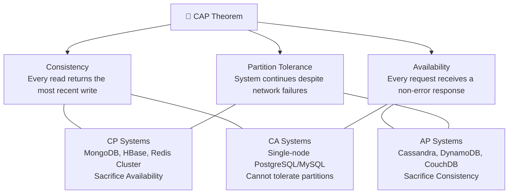
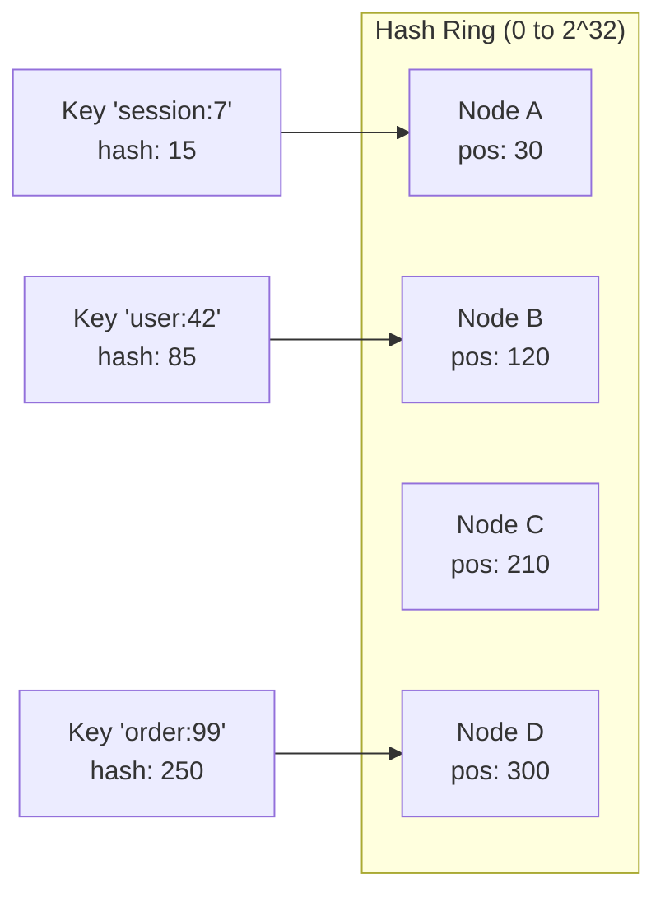

# 🧱 System Design Fundamentals — The Root Principles

Every distributed system decision is a **trade-off**. There is no "best" architecture — only the architecture that best fits your constraints (traffic, team size, budget, latency requirements). This document covers the foundational theorems and mental models that every architect must internalize before making any system design decision.

---

## 1. CAP Theorem — The Fundamental Constraint

In a distributed data store, you can only guarantee **2 out of 3** properties simultaneously:



### Why is Partition Tolerance (P) mandatory?

In any real distributed system, network partitions **will** happen. Cables get cut, switches fail, cloud AZs lose connectivity. You cannot prevent it. Therefore, the real choice is always between **CP** and **AP**:

| Choice | Behavior During Partition | Use Case |
|--------|--------------------------|----------|
| **CP** | Rejects writes/reads to maintain consistency. Returns errors. | Banking, inventory, leader election |
| **AP** | Continues serving requests but may return stale data. | Social media feeds, product catalogs, DNS |

### Real-World Examples

| Database | CAP Type | Behavior |
|----------|----------|----------|
| PostgreSQL (single node) | CA | No partition tolerance — single machine |
| PostgreSQL + Streaming Replication | CP | Promotes standby, rejects writes during failover |
| MongoDB (default write concern) | CP | Primary election blocks writes during partition |
| Cassandra | AP | Continues serving all nodes, reconciles later via vector clocks |
| DynamoDB | AP (tunable) | Eventual consistency default, optional strong reads |
| Redis Cluster | CP | Majority partition keeps serving, minority rejects writes |
| CockroachDB | CP | Raft consensus, blocks writes without quorum |

### 🚨 Common Misconception
> "I'll just pick CA and avoid the problem."

**Wrong.** CA only works on a single machine. The moment you add a second node (for scaling or HA), network partitions become possible. In production, every distributed system is either CP or AP.

---

## 2. PACELC Theorem — Beyond Partitions

CAP only describes behavior **during a partition**. But what about normal operation (99.9% of the time)? PACELC extends CAP:

> **If Partition (P):** trade off between **Availability (A)** and **Consistency (C)**
> **Else (E):** trade off between **Latency (L)** and **Consistency (C)**

This is crucial because even without partitions, enforcing strong consistency requires coordination (round-trips between replicas), which increases latency.

| Database | P → A or C? | E → L or C? | Explanation |
|----------|-------------|-------------|-------------|
| DynamoDB | PA | EL | Prioritizes availability + low latency. Eventual consistency default. |
| Cassandra | PA | EL | Same philosophy. Tunable consistency per query. |
| PostgreSQL (sync replication) | PC | EC | Waits for replica ack → higher latency but consistent |
| MongoDB (w:majority) | PC | EC | Waits for majority write ack |
| CockroachDB | PC | EC | Raft consensus always, consistent but higher latency |
| Cosmos DB | PA/PC (tunable) | EL/EC (tunable) | 5 consistency levels from strong to eventual |

### Practical Takeaway
- **Read-heavy, latency-sensitive** (product catalog, social feed): Choose PA/EL (DynamoDB, Cassandra)
- **Write correctness critical** (payments, inventory): Choose PC/EC (PostgreSQL, CockroachDB)
- **Mixed workloads**: Use tunable consistency (Cosmos DB, Cassandra per-query CL)

---

## 3. Data Consistency Models

Understanding these models is essential for choosing the right database and replication strategy:

### Strong Consistency
Every read returns the **most recent write**. All nodes agree on the same value at any point in time.
- **Implementation:** Synchronous replication, distributed consensus (Raft, Paxos)
- **Cost:** Higher latency (must wait for quorum), lower throughput
- **When:** Financial transactions, inventory count, leader election
- **Example:** `SELECT balance FROM accounts WHERE id = 123` → Always returns the latest after any transfer

### Eventual Consistency
If no new writes occur, all replicas will **eventually** converge to the same value. Reads may return stale data temporarily.
- **Implementation:** Asynchronous replication, conflict resolution (Last-Write-Wins, vector clocks, CRDTs)
- **Cost:** Low latency, high availability
- **When:** Social media likes/followers count, product reviews, session data
- **Typical Lag:** 10ms - 2 seconds in normal conditions; can spike during network issues

### Read-Your-Own-Writes Consistency
After a user writes data, **that same user** always sees their own write. Other users may see stale data.
- **Implementation:** Route reads to the same replica that accepted the write, or use sticky sessions
- **When:** User profile updates ("I changed my name, I should see it immediately")
- **Example:** After posting a comment, the poster sees it instantly. Other users may see it 1-2s later.

### Monotonic Reads
Once a user reads a value, subsequent reads will **never** return an older value (no "going back in time").
- **Implementation:** Pin user to a specific replica, or track read position per session
- **When:** Chat messages, activity feeds (you should never see an older version of a conversation)

### Causal Consistency
If event A causes event B, then anyone who sees B will also see A. Preserves cause-and-effect ordering.
- **Implementation:** Vector clocks, logical timestamps (Lamport clocks)
- **When:** Comment replies (reply must appear after parent comment), collaborative editing

### Linearizability (Strongest)
The strongest consistency model. Operations appear to execute atomically at some point between their invocation and completion. As if there's a single copy of the data.
- **Implementation:** Consensus protocols (Raft, Paxos, ZAB)
- **Cost:** Very expensive in distributed systems
- **When:** Distributed locks, leader election, unique ID generation

```
Strength Spectrum:

Eventual → Monotonic Reads → Read-Your-Writes → Causal → Sequential → Linearizable
  (weak)                                                                (strongest)
   ←── Lower Latency                                    Higher Latency ──→
   ←── Higher Availability                          Lower Availability ──→
```

---

## 4. Latency Numbers Every Architect Should Know

These numbers shape every architectural decision. Memorize the **orders of magnitude**:

| Operation | Latency | Note |
|-----------|---------|------|
| L1 cache reference | 1 ns | |
| L2 cache reference | 4 ns | |
| Main memory (RAM) reference | 100 ns | |
| SSD random read | 16 μs | ~100x slower than RAM |
| HDD random read | 2 ms | ~125x slower than SSD |
| Round trip within same datacenter | 500 μs | |
| **Read 1MB from memory** | **250 μs** | |
| **Read 1MB from SSD** | **1 ms** | |
| **Read 1MB from HDD** | **20 ms** | |
| **Round trip same region (AZ ↔ AZ)** | **1 ms** | |
| **DNS lookup** | **~10 ms** | Can be cached |
| **TLS handshake** | **~10 ms** | Per new connection |
| **Round trip cross-continent** | **~150 ms** | US East ↔ EU West |
| Read 1MB from network (1 Gbps) | 10 ms | |
| Send packet CA → NL → CA | 150 ms | Speed of light limit |

### Architectural Implications
- **In-process cache (L1)** is 1,000,000x faster than cross-region call → Always cache locally first
- **SSD** is 125x faster than HDD → Never use HDD for hot data
- **Cross-AZ** is 2x the latency of same-AZ → Co-locate services that talk frequently
- **Cross-region** is 150x cross-AZ → Use eventual consistency for global replication, CDN for static content

---

## 5. Communication Protocols — When to Use What

| Protocol | Type | Latency | Payload | Best For |
|----------|------|---------|---------|----------|
| **REST/HTTP** | Sync, Request-Response | Medium (~50-200ms) | JSON (human-readable) | Public APIs, CRUD, browser clients |
| **gRPC** | Sync, Request-Response + Streaming | Low (~10-50ms) | Protobuf (binary, compact) | Service-to-service, low-latency, strongly typed |
| **GraphQL** | Sync, Request-Response | Medium | JSON (flexible query) | Frontend-driven APIs, mobile (reduce over-fetching) |
| **WebSocket** | Full-duplex, persistent | Very Low (~1-5ms) | Any | Real-time: chat, notifications, live dashboards |
| **Server-Sent Events (SSE)** | One-way streaming | Low | Text/JSON | Live feeds, stock tickers (server → client only) |
| **Message Queue (SQS/Kafka)** | Async, decoupled | Variable (ms to seconds) | Any | Event-driven, decouple producers/consumers |

### Decision Framework
```
Is the client a browser/mobile?
  ├── Yes → Need real-time?
  │         ├── Yes → WebSocket or SSE
  │         └── No  → REST (simple) or GraphQL (complex nested data)
  └── No (service-to-service) → 
          ├── Need immediate response? → gRPC (fastest) or REST (simpler)
          └── Can be async? → Message Queue (SQS, Kafka, RabbitMQ)
```

---

## 6. Consistent Hashing — The Key to Distributed Systems

Traditional hash-based distribution (`hash(key) % N`) breaks catastrophically when you add/remove nodes — ALL keys need to be remapped. Consistent Hashing solves this.



- Keys are hashed to a position on a ring (0 to 2^32)
- Each node is also mapped to a position on the ring
- A key is stored on the **first node encountered clockwise** from its hash position
- When a node is added/removed, only keys between the affected node and its predecessor are remapped (~K/N keys, not all K keys)

### Virtual Nodes
Problem: With few physical nodes, data distribution can be uneven. Solution: Each physical node maps to **100-200 virtual positions** on the ring, ensuring even distribution.

### Where It's Used
- **DynamoDB**: Partition key hashing for data distribution
- **Cassandra**: Token ring for data placement
- **Redis Cluster**: Hash slots (16384 slots distributed across nodes)
- **CDN**: Route requests to nearest cache server
- **Load Balancers**: Consistent session routing

---

## 🔥 Common Problems & Interview Gotchas

### Problem 1: "We chose AP but need consistency for payments"
**Solution:** Use different consistency levels for different operations. Read product catalog from AP store (Cassandra), but process payments through CP store (PostgreSQL). One system can use multiple databases.

### Problem 2: "Eventual consistency — but HOW eventual?"
**The dirty secret:** "Eventually" could mean 10ms or 10 minutes. You MUST measure replication lag and set alerts. In AWS DynamoDB, eventual consistency reads are typically 1 second behind. If your business can't tolerate that, use `ConsistentRead: true`.

### Problem 3: "Split-brain during network partition"
Two nodes both think they're the leader → both accept writes → conflicting data. 
**Solution:** Quorum-based consensus (Raft): Leader needs majority acknowledgment. Use fencing tokens to prevent stale leaders from writing.

### Problem 4: "Our architect said gRPC for everything"
gRPC is great for service-to-service, but terrible for browser clients (limited browser gRPC-Web support), debugging (binary Protobuf is unreadable), and public APIs (developers expect REST/JSON). **Use the right protocol for the right boundary.**

### Problem 5: "Consistent Hashing sounds like magic"
It reduces key remapping from O(K) to O(K/N), but with hot keys (celebrity user, viral post), one node still gets hammered. **Solution:** Add a random suffix to hot keys to spread load, or use a local cache in front.

### Problem 6: "We need exactly-once delivery"
**Impossible** in distributed systems (FLP impossibility, Byzantine Generals). You can only achieve **exactly-once processing** via idempotent consumers. Always design your system to handle duplicate messages safely.

---

## 📍 Case Study — Answer & Discussion

> **Q:** You are designing a system to display the 'Like' count on Facebook. Which Consistency model would you choose and why? What if it was a banking transaction system?

### Facebook Like Count → **Eventual Consistency**

**Reasoning:**
1. **Volume:** Billions of likes/day. Strong consistency would require synchronous replication across all datacenters → unacceptable latency and cost.
2. **Tolerance for Staleness:** If a post shows "1,042 likes" for 2 seconds while the actual count is 1,043, no one notices or cares. The business impact of a stale like count is zero.
3. **Availability > Consistency:** If a datacenter goes down, users should still see the feed (with slightly stale counts) rather than getting an error page.
4. **Implementation:** 
   - Counter stored in Cassandra (AP, EL) with `COUNTER` data type
   - Each datacenter writes locally → asynchronous replication → eventual merge
   - Conflict resolution: Cassandra counters use CRDTs (Conflict-free Replicated Data Types) — automatically converge

### Banking Transaction → **Strong Consistency (Linearizability)**

**Reasoning:**
1. **Correctness is non-negotiable:** If Alice transfers $500 to Bob, both balances must update atomically. A stale read showing $1000 when the real balance is $500 could allow double-spending.
2. **Regulatory compliance:** Financial systems are audited. Every transaction must be traceable and consistent.
3. **Low-volume, high-value:** Banking systems process orders of magnitude fewer transactions than social media → the latency cost of strong consistency is acceptable.
4. **Implementation:**
   - PostgreSQL with synchronous replication (or CockroachDB for distributed SQL)
   - Serializable transaction isolation level
   - Distributed transactions via Saga pattern (cross-service) — never 2PC
   - All reads go through the primary (or use `ConsistentRead` if DynamoDB)

### The Hybrid Approach (Real-World)
Most systems use **both** — different consistency for different data:
- **Strong:** Account balance, order status, inventory count
- **Eventual:** Notifications count, recommendation feed, analytics dashboards
- **Read-your-writes:** User profile updates, posted comments
