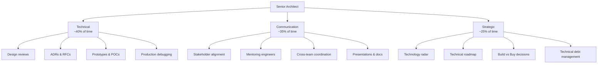
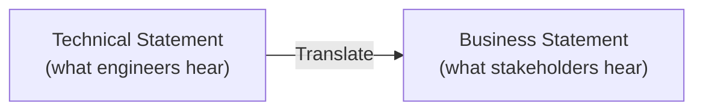
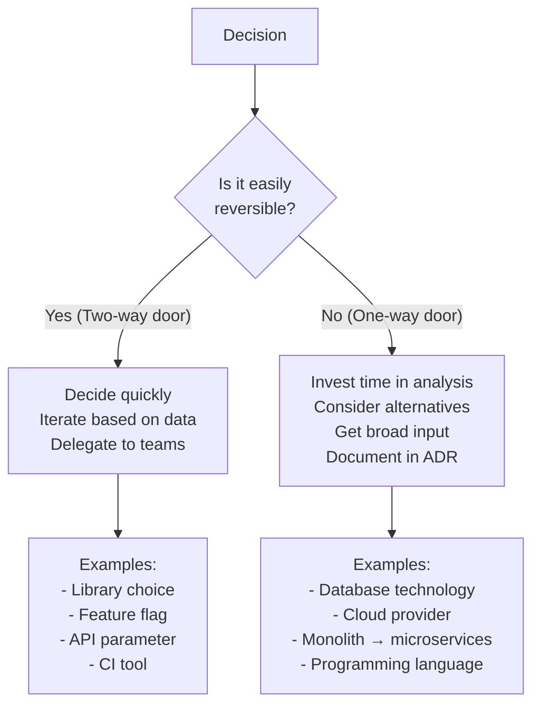
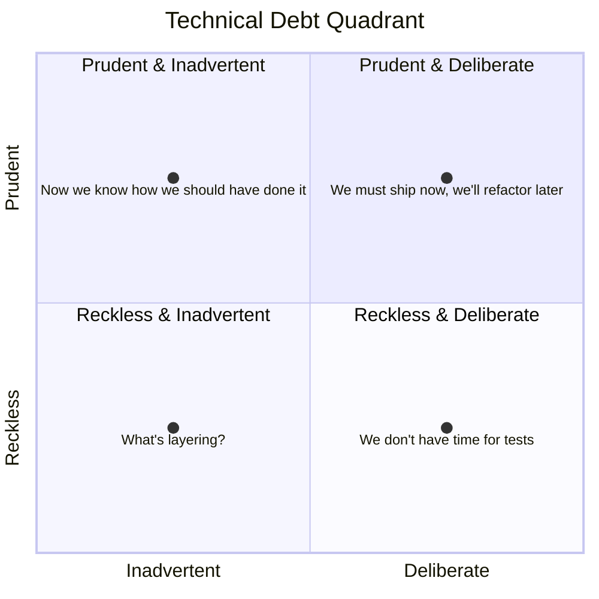

# 🎯 Tech Leadership & Communication

The difference between a Senior Engineer and an Architect is not technical depth — it's **influence, communication, and decision-making at scale**. An architect who can't communicate decisions to stakeholders, align teams, and manage trade-offs is just an expensive developer.

> "The best architects are the ones who can explain complex systems to a 5-year-old and then build them." — Unknown

---

## 1. The Architect's Role — What You Actually Do



### Common Anti-Patterns

| Anti-Pattern | What Happens | Fix |
|-------------|-------------|-----|
| **Ivory Tower Architect** | Makes decisions from a distance, never writes code, loses touch with reality | Stay hands-on: write prototypes, do code reviews, debug production issues |
| **Architecture Astronaut** | Over-engineers everything, abstracts away all the problems into generic frameworks | YAGNI — design for current needs with extension points, not all possible futures |
| **Gatekeeping Architect** | Every PR needs their approval → bottleneck → teams slow down | Create guardrails (CI checks, lint rules, templates) not gates. Trust team decisions within guardrails |
| **Resume-Driven Architect** | Chooses technologies because they're trendy, not because they solve the problem | Decision must pass the "Why not the boring solution?" test |
| **Silent Architect** | Great designs, terrible communication → nobody follows the architecture | Document everything, present to teams, get buy-in BEFORE designing |

---

## 2. Communicating Technical Decisions

### Translating Tech to Business

The #1 skill of a senior architect: every technical decision must be expressed in **business impact**.



| ❌ Technical Language | ✅ Business Language |
|---------------------|-------------------|
| "We need to refactor the database layer" | "Current system can handle 500 orders/hour. Black Friday needs 5,000. Without changes, we'll lose $200K in revenue from order failures." |
| "We should migrate to Kubernetes" | "Current deployment takes 45 minutes with 10 minutes downtime. K8s reduces this to 2 minutes with zero downtime → 3x more features shipped per sprint." |
| "We need to add observability" | "Last month's outage took 4 hours to detect. With monitoring, detection drops to 2 minutes → saves $10K per incident, prevents customer churn." |
| "We should use event-driven architecture" | "Currently, adding a new notification channel requires changing 5 services and 2 weeks of work. Event-driven reduces this to 1 service and 2 days." |
| "The code has too much technical debt" | "New features that should take 1 week now take 3 weeks because engineers work around old code. Investment: 2 sprints now saves 1 sprint per quarter ongoing." |

### The STAR Framework for Technical Proposals

```
Situation: Where are we now? (Current state, metrics, pain points)
Task:      What needs to change? (Problem statement)
Action:    What do we propose? (Solution with alternatives considered)
Result:    What will improve? (Expected metrics, timeline, cost)
```

**Example:**
```
Situation: File uploads > 50MB fail 30% of the time due to timeout.
           This affects 200 enterprise users who upload large documents daily.
           
Task:      Support reliable uploads up to 500MB without timeout failures.

Action:    Implement multipart upload via S3 pre-signed URLs.
           Alternative considered: Increase timeout → rejected because it 
           doesn't solve the root cause and wastes server resources.
           
Result:    - Upload success rate: 70% → 99.9%
           - Max file size: 50MB → 5GB
           - Server memory usage: -60% (direct-to-S3, bypasses server)
           - Timeline: 1 sprint (2 weeks)
           - Cost: +$20/month S3 transfer
```

---

## 3. Technical Writing for Architects

### Document Types & When to Use Them

| Document | When | Length | Audience |
|----------|------|--------|----------|
| **ADR** | Recording a specific decision | 1-2 pages | Engineering team |
| **RFC** | Proposing a change, requesting feedback | 3-5 pages | Engineering + stakeholders |
| **Design Doc** | Detailed technical plan for complex feature | 5-10 pages | Engineering team |
| **Architecture Overview** | High-level system description | 2-4 pages | New team members, stakeholders |
| **Runbook** | Step-by-step for operational procedures | 1-3 pages | On-call engineers |
| **Postmortem** | Learning from incidents | 2-3 pages | Engineering + management |

### Writing Principles

1. **Lead with the punchline.** First paragraph should state: what's the problem, what's the solution, what's the impact. Details come after.

2. **One idea per paragraph.** If you need to scroll back to understand the current sentence, the paragraph is too long.

3. **Use diagrams.** A Mermaid diagram replaces 500 words and is unambiguous.

4. **Write for the skeptic.** Anticipate "why not X?" and address it proactively.

5. **Include non-goals.** Explicitly state what you're NOT solving. This prevents scope creep.

```markdown
## Non-Goals (Out of Scope)
- This design does NOT address multi-tenancy (separate RFC)
- We will NOT support real-time streaming (batch processing only)
- Authentication changes are out of scope (handled by ADR-015)
```

### Diagramming as Communication

| Diagram Type | When | Tool |
|-------------|------|------|
| **Architecture Overview** (C4 Model) | System context, containers, components | Mermaid, C4-PlantUML |
| **Sequence Diagram** | Request flows, multi-service interactions | Mermaid |
| **Entity Relationship** | Data models, database schemas | Mermaid, dbdiagram.io |
| **State Machine** | Workflow states, lifecycle | Mermaid stateDiagram |
| **Decision Tree** | Decision frameworks, troubleshooting | Mermaid flowchart |
| **Infrastructure** | Cloud architecture, network topology | draw.io, Excalidraw, Mermaid |

---

## 4. Decision-Making Frameworks

### The Reversibility Framework (One-Way vs Two-Way Doors)



### The DACI Framework

For every significant decision, clarify roles:

| Role | Who | Responsibility |
|------|-----|---------------|
| **D**river | Architect or Tech Lead | Drives the process, gathers input, writes ADR |
| **A**pprover | VP Eng / CTO | Makes the final call, resolves deadlocks |
| **C**ontributors | Senior engineers, PMs, affected teams | Provide input, raise concerns, suggest alternatives |
| **I**nformed | Broader team, stakeholders | Need to know the outcome, don't participate in decision |

### When to Use Each

| Decision Type | Framework | Example |
|--------------|-----------|---------|
| Technology choice | ADR + DACI | "Use PostgreSQL vs DynamoDB" |
| Feature design | RFC + Design Doc | "Build real-time notification system" |
| Process change | RFC + Team vote | "Switch from Scrum to Kanban" |
| Incident response | Runbook + Postmortem | "Database failover procedure" |
| Quick decision | Async Slack poll | "Use Jest vs Vitest for new tests" |

---

## 5. Mentoring & Growing Engineers

### The Architecture Mentoring Ladder

```
Junior Engineer → Mid Engineer → Senior Engineer → Staff → Architect

What each level should be able to:

Junior:    Implement a feature given a design
Mid:       Design a feature within an existing system
Senior:    Design a system component, identify trade-offs
Staff:     Design a system end-to-end, influence cross-team
Architect: Design systems of systems, align technology with business
```

### How Architects Mentor

| Technique | How | When |
|-----------|-----|------|
| **Code review as teaching** | Don't just say "change this." Explain WHY, link to resources, suggest experiments | Every PR |
| **Architecture kata** | Weekly 1-hour sessions where the team designs a system together | Weekly |
| **Pair programming** | Architect pairs with mid-level engineer on a complex task | Monthly |
| **Book club** | Team reads "Designing Data-Intensive Applications" chapter by chapter | Bi-weekly |
| **Decision logs** | Let seniors propose ADRs, architect reviews and coaches the process | Per decision |
| **Shadow on-call** | Junior/mid shadow senior/architect during on-call rotation | Per rotation |

### The "Steal Like an Architect" Method

```
1. Study real architectures:
   - Netflix: zuul, eureka, hystrix (microservices pioneer)
   - Uber: ringpop, DOSA, Schemaless (extreme scale)
   - Stripe: idempotency, API versioning (API design excellence)
   - Shopify: Pod architecture (multi-tenant scaling)
   
2. For each, ask:
   - What problem did they solve?
   - What trade-offs did they accept?
   - What would they do differently today?
   - Does this apply to my system?
   
3. Document insights in team wiki
```

---

## 6. Managing Technical Debt

### Technical Debt Quadrant (Martin Fowler)



| Quadrant | Example | How to Handle |
|----------|---------|--------------|
| **Prudent & Deliberate** | "We know this design won't scale past 10K users, but we need to ship the MVP. We'll revisit in Q2." | ✅ Acceptable. Document in ADR with deadline. |
| **Prudent & Inadvertent** | "Now that we understand the domain better, we realize the module boundaries are wrong." | ✅ Normal. Refactor when it blocks new features. |
| **Reckless & Deliberate** | "We don't have time for tests or error handling. Ship it." | ❌ Dangerous. Push back. At minimum, document the risk. |
| **Reckless & Inadvertent** | "We didn't know about SQL injection." | ❌ Education problem. Invest in training and code review. |

### Communicating Tech Debt to Stakeholders

```
❌ "We need 2 sprints for refactoring"
   → CEO hears: "Wasting money on invisible work"

✅ "Feature X currently takes 3 weeks to build because of legacy patterns.
    A 2-sprint investment reduces future feature time from 3 weeks to 1 week.
    Over the next 4 features, we save 8 weeks of engineering time = $80K."
   → CEO hears: "Good investment, 4x return"
```

### Tech Debt Tracking

```markdown
## Tech Debt Register

| ID | Description | Impact | Effort | Priority | Owner | Deadline |
|----|------------|--------|--------|----------|-------|----------|
| TD-001 | No retry on S3 upload failure | 2% upload failures (50 users/day) | 1 day | P1 | @eng-a | Sprint 12 |
| TD-002 | Hardcoded timeouts in Lambda | Can't tune per environment | 2 days | P2 | @eng-b | Q1 |
| TD-003 | No pagination on search results | Memory issues at 10K+ results | 3 days | P2 | @eng-a | Q1 |
| TD-004 | Monolithic Lambda handler | Testing is painful, hard to add features | 1 sprint | P3 | Team | Q2 |
```

---

## 7. Cross-Team Alignment

### Architecture Review Board (ARB) — Done Right

| ❌ Bad ARB | ✅ Good ARB |
|-----------|-----------|
| Monthly 3-hour meeting | Async ADR review + 30-min sync meeting only for contentious decisions |
| Architect approves every design | Architect sets guardrails, teams decide within guardrails |
| Bottleneck for all decisions | Only reviews cross-team or irreversible decisions |
| Focuses on "is this the right technology?" | Focuses on "does this align with our principles and constraints?" |

### Architecture Principles (Guardrails)

Define 5-10 non-negotiable principles that teams use for self-governance:

```
1. API-First: All services expose a versioned API contract before implementation
2. Observability Built-In: Every service must export metrics, traces, and structured logs
3. Infrastructure as Code: No manual cloud console changes in production
4. Fail Gracefully: Every external call must have timeout, retry, and circuit breaker
5. Data Ownership: Each service owns its data. No shared databases.
6. Security by Default: All communication encrypted. No hardcoded secrets. Least privilege IAM.
7. Automate Everything: If you do it twice manually, automate it the third time.
```

Teams can make any decision that doesn't violate these principles without asking the architect.

---

## 🔥 Real Leadership Challenges

### Challenge 1: "The Team Won't Follow the Architecture"
**Situation:** Architect designed a clean hexagonal architecture. Team keeps adding business logic directly in controllers because "it's faster."
**Root cause:** Architecture was imposed, not explained. Team doesn't understand the WHY.
**Fix:** Pair programming session showing the pain of testing controller logic vs port logic. Create a "good example" service that others can copy. Add linting rules to prevent direct DB access from controllers.

### Challenge 2: "Stakeholders Want Everything Now"
**Situation:** PM wants Feature A (2 weeks), Feature B (3 weeks), and Feature C (1 week) all delivered in the next 2-week sprint.
**Fix:** Use the iron triangle framework:
```
Scope: "We can deliver A + C in 2 weeks. B needs 1 more week."
Quality: "We can ship all 3 in 2 weeks without tests. But we'll spend 3 weeks fixing bugs."
Time: "All 3 with quality needs 4 weeks."
→ "Which constraint do you want to flex? I recommend reducing scope."
```

### Challenge 3: "Two Teams Disagree on Technology"
**Situation:** Team A wants Kafka, Team B wants SQS. Both have valid arguments. Meeting is going in circles.
**Fix:**
1. Write an ADR with both options, pros/cons, scored against decision criteria
2. Define decision criteria BEFORE evaluating options (scalability, operational cost, team expertise, vendor lock-in)
3. If tied: use the "Regret Minimization" test — "Which decision will we regret more in 2 years?"
4. If still tied: choose the simpler option. Make the decision and move on.

### Challenge 4: "I Was Wrong About a Previous Decision"
**Situation:** Architect chose MongoDB 2 years ago. System now has many relational queries, JOINs done in application code, inconsistency bugs.
**Fix:** Write a new ADR that supersedes the original:
```
ADR-042: Migrate critical paths from MongoDB to PostgreSQL
Status: Accepted (supersedes ADR-003)
Context: We chose MongoDB for schema flexibility in 2023 (ADR-003). 
Since then, our data model stabilized and 80% of queries are relational.
Application-level JOINs cause latency spikes and consistency bugs.
```
**Key:** This is not a failure — it's a natural evolution. Document the learning for future reference.

---

## 📍 Summary: The Architect's Playbook

```
Daily:
  - Review 2-3 PRs with educational, constructive comments
  - Check SLO dashboards and error budget burn rate
  - Respond to technical questions in team channels

Weekly:
  - 1 architecture decision (ADR or RFC review)
  - 1 mentoring session (pair programming, architecture kata, 1:1)
  - Update technical debt register

Monthly:
  - Architecture review meeting (30 min, focused on cross-team concerns)
  - Technology radar update (what to adopt, trial, assess, hold)
  - Stakeholder update (business-language summary of technical progress)

Quarterly:
  - Review and update SLO targets
  - DR drill / disaster recovery test
  - Technical roadmap refresh
  - Retrospective on architectural decisions made last quarter
```
