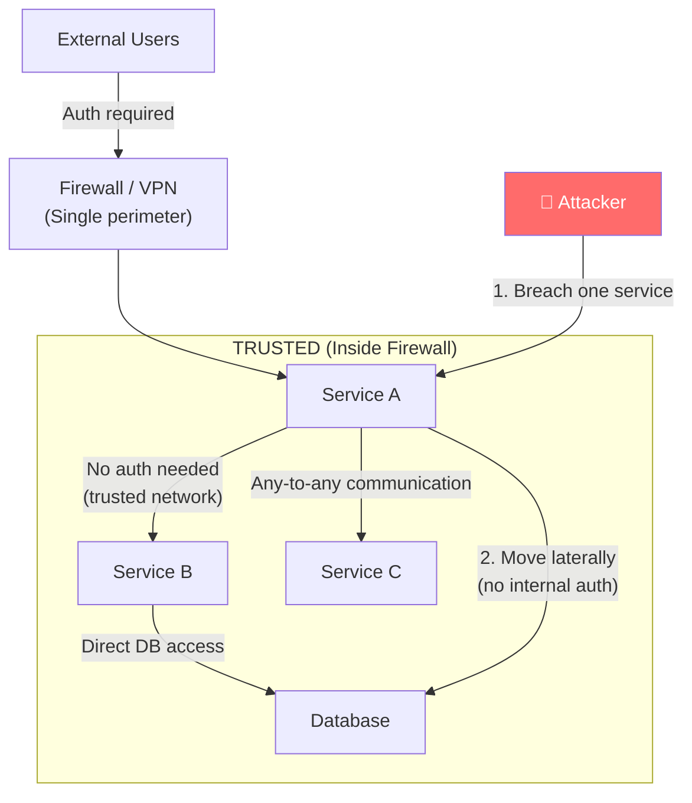
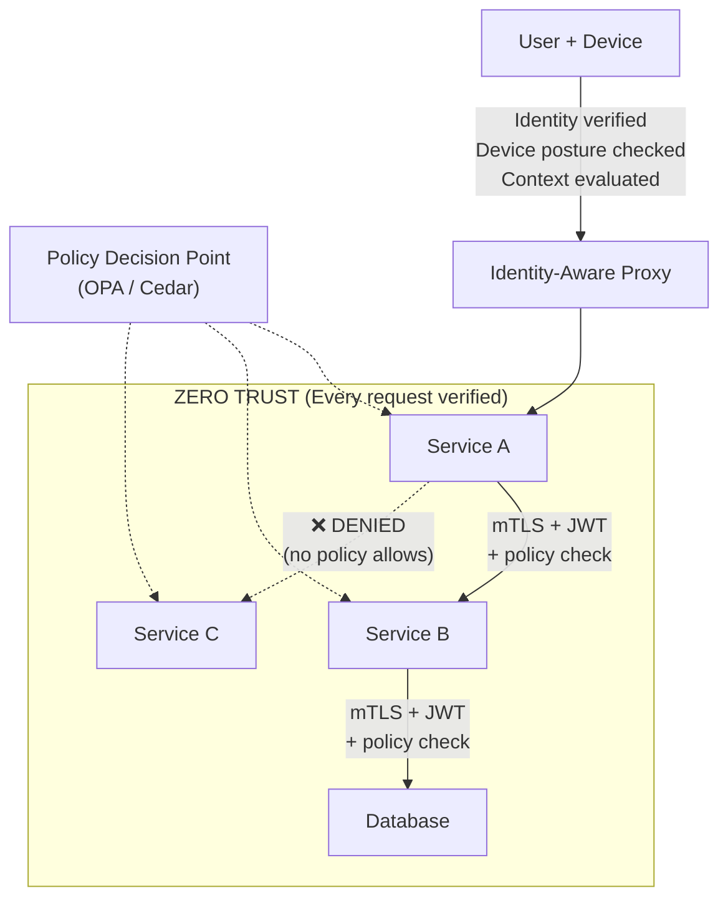
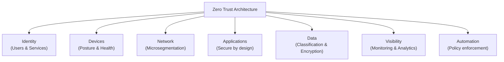
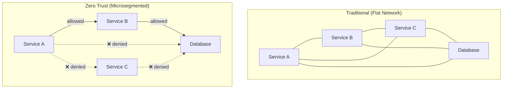
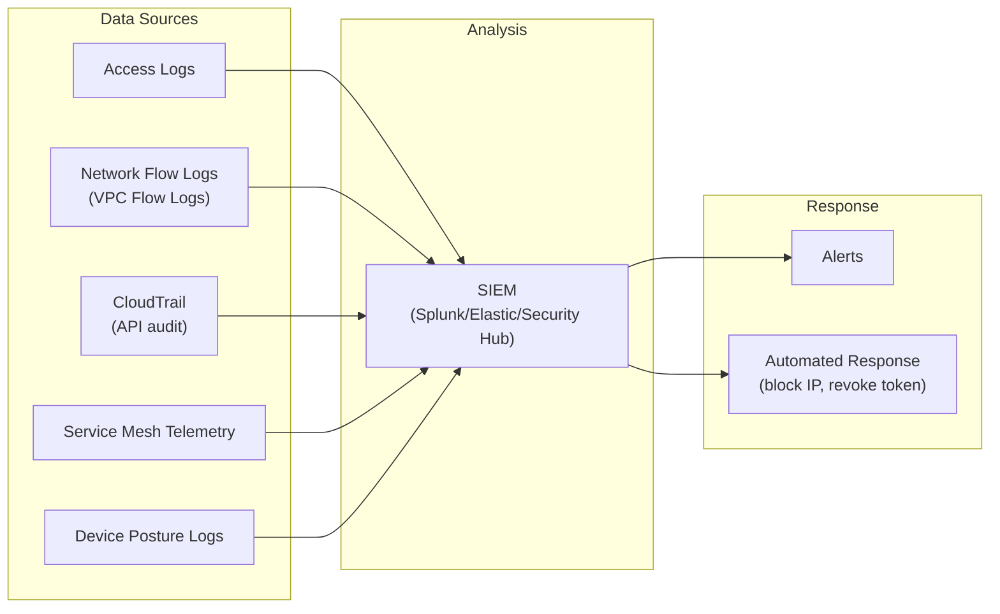
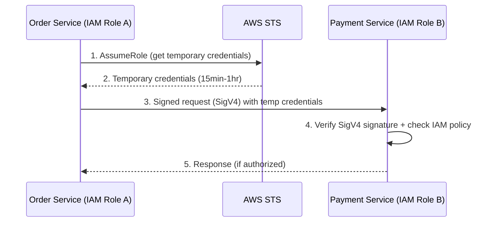
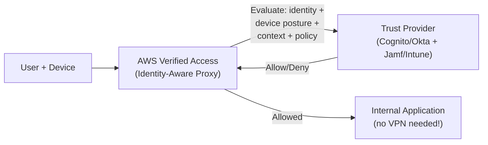

# 🛡️ Zero Trust Architecture

The traditional security model — "trust everything inside the network perimeter" — is dead. Cloud, remote work, microservices, and APIs have dissolved the perimeter. **Zero Trust** assumes every request is potentially malicious, regardless of where it originates.

> "Never trust, always verify." — Zero Trust principle

---

## 1. Why Perimeter Security Failed

### Traditional Model (Castle-and-Moat)



**Problems:**
- Once inside the perimeter, attackers move laterally without restriction
- VPN gives full network access (all-or-nothing)
- Cloud workloads don't have a clear "inside"
- Remote workers, contractors, and third-party APIs blur the boundary
- Microservices communicate over the network → network = untrusted

### Zero Trust Model



---

## 2. Zero Trust Principles

| Principle | What | Implementation |
|-----------|------|---------------|
| **Verify explicitly** | Always authenticate and authorize based on all available data points | MFA, device posture, location, risk score |
| **Least privilege access** | Limit access to the minimum needed, just-in-time and just-enough | RBAC/ABAC, temporary credentials, scoped tokens |
| **Assume breach** | Minimize blast radius, segment access, verify end-to-end encryption | Microsegmentation, mTLS, audit logging |
| **Never trust the network** | Network location doesn't grant trust | Service mesh, identity-based routing |

---

## 3. Zero Trust Pillars — NIST SP 800-207



### Pillar 1: Identity — The New Perimeter

Identity is the foundation of Zero Trust. Every access request must be tied to a verified identity.

| Component | Traditional | Zero Trust |
|-----------|------------|------------|
| **User identity** | Username + password | MFA + SSO + risk-based auth + device posture |
| **Service identity** | IP address / network segment | mTLS certificate, SPIFFE ID, IAM role |
| **Authorization** | Network ACL (if you can reach it, you can access it) | Policy engine evaluates every request |
| **Session** | Persistent (login once, access everything) | Continuous verification (re-evaluate on each request) |

**SPIFFE (Secure Production Identity Framework):**
```
spiffe://cluster.local/ns/production/sa/order-service
│        │              │              │
│        Trust domain   Namespace      Service account
│
SPIFFE URI scheme
```
Every service gets a cryptographic identity (X.509 certificate) via SPIRE. No more trusting IP addresses.

### Pillar 2: Devices — Trust the Device, Not Just the User

```
Access Decision = f(identity, device_posture, context, policy)

Device Posture Checks:
  ✅ OS up to date (latest security patches)
  ✅ Disk encryption enabled (BitLocker/FileVault)
  ✅ Antivirus active and updated
  ✅ Device managed by MDM (Intune, Jamf)
  ✅ No jailbreak/root detected
  ❌ Any check fails → limited access or denied
```

**Tools:** Microsoft Intune, Google BeyondCorp, Okta Device Trust, Jamf

### Pillar 3: Network — Microsegmentation

Replace flat networks with **microsegments** where each workload has its own access policy.



**AWS Implementation:**
| Tool | Scope | How |
|------|-------|-----|
| **Security Groups** | Instance level | Allow only specific ports/sources per service |
| **NACLs** | Subnet level | Stateless firewall rules |
| **VPC endpoints** | Service level | Keep AWS service calls within VPC (never traverse internet) |
| **PrivateLink** | Cross-account/service | Private connectivity without VPC peering |
| **Service Mesh (Istio/Linkerd)** | Pod/container level | mTLS + authorization policies per service pair |

### Pillar 4: Applications — Secure by Design

```
Application Security in Zero Trust:
  1. Input validation at every boundary (API Gateway + service level)
  2. Output encoding (prevent injection)
  3. Authentication at every service (not just the edge)
  4. Authorization per endpoint/action (not per service)
  5. Secrets injected at runtime (Secrets Manager, not env vars)
  6. Dependencies scanned (Snyk, Dependabot)
  7. Container images scanned (Trivy, Grype)
```

### Pillar 5: Data — Classify, Encrypt, Control

| Data State | Protection | AWS Service |
|-----------|-----------|-------------|
| **At rest** | AES-256 encryption | S3 SSE-KMS, RDS encryption, EBS encryption |
| **In transit** | TLS 1.2+ / mTLS | ALB TLS termination, service mesh mTLS |
| **In use** | Minimal exposure, tokenization | AWS Nitro Enclaves, field-level encryption |

**Data Classification:**
```
PUBLIC      → Marketing content, public API docs
INTERNAL    → Internal tools, non-sensitive business data
CONFIDENTIAL → Customer PII, financial data, health records
RESTRICTED  → Encryption keys, root credentials, trade secrets
```

Each classification level determines: encryption requirements, access controls, retention policies, audit requirements, and acceptable storage locations.

### Pillar 6: Visibility — You Can't Protect What You Can't See



---

## 4. Implementing Zero Trust on AWS

### Service-to-Service Authentication



### IAM Policy — Least Privilege Example

```json
{
  "Version": "2012-10-17",
  "Statement": [
    {
      "Effect": "Allow",
      "Action": [
        "s3:GetObject",
        "s3:PutObject"
      ],
      "Resource": "arn:aws:s3:::file-uploads-bucket/uploads/*",
      "Condition": {
        "StringEquals": {
          "aws:PrincipalTag/service": "file-processor"
        },
        "IpAddress": {
          "aws:SourceIp": "10.0.0.0/8"
        }
      }
    }
  ]
}
```

**Key Points:**
- Specific actions (not `s3:*`)
- Specific resource (not `*`)
- Conditions (service tag + source IP)
- Temporary credentials (STS AssumeRole, not long-lived keys)

### VPC Design for Zero Trust

```
VPC (10.0.0.0/16)
├── Public Subnets (10.0.1.0/24, 10.0.2.0/24)
│   └── ALB only (no application instances)
│
├── Private Subnets - App (10.0.10.0/24, 10.0.11.0/24)
│   ├── ECS Tasks (file-processor)
│   ├── Security Group: Allow inbound from ALB SG only
│   └── VPC Endpoint: S3, SQS, Secrets Manager (no NAT needed)
│
├── Private Subnets - Data (10.0.20.0/24, 10.0.21.0/24)
│   ├── RDS, ElastiCache, OpenSearch
│   ├── Security Group: Allow inbound from App SG only (port 5432, 6379, 443)
│   └── No internet access (no NAT, no IGW)
│
└── VPC Endpoints (no traffic leaves VPC)
    ├── com.amazonaws.region.s3 (Gateway endpoint - free)
    ├── com.amazonaws.region.sqs (Interface endpoint)
    ├── com.amazonaws.region.secretsmanager (Interface endpoint)
    └── com.amazonaws.region.logs (Interface endpoint)
```

---

## 5. mTLS (Mutual TLS) — Service Mesh

### Regular TLS vs mTLS

| | Regular TLS | mTLS |
|---|---|---|
| **Client verifies server** | ✅ | ✅ |
| **Server verifies client** | ❌ | ✅ |
| **Use case** | Browser → HTTPS website | Service A → Service B (internal) |
| **Identity** | Server only (certificate) | Both sides (both have certificates) |

### mTLS with Service Mesh (Istio)

```yaml
# Istio PeerAuthentication: Require mTLS for all services in namespace
apiVersion: security.istio.io/v1beta1
kind: PeerAuthentication
metadata:
  name: default
  namespace: production
spec:
  mtls:
    mode: STRICT  # All traffic must be mTLS encrypted

---
# Istio AuthorizationPolicy: Only Order Service can call Payment Service
apiVersion: security.istio.io/v1beta1
kind: AuthorizationPolicy
metadata:
  name: payment-service-policy
  namespace: production
spec:
  selector:
    matchLabels:
      app: payment-service
  rules:
    - from:
        - source:
            principals: ["cluster.local/ns/production/sa/order-service"]
      to:
        - operation:
            methods: ["POST"]
            paths: ["/api/payments"]
```

---

## 6. BeyondCorp — Google's Zero Trust Model

Google eliminated VPN entirely. Every access request goes through an **Identity-Aware Proxy** that evaluates:

```
Access Decision = evaluate(
  user_identity,          // WHO: verified via SSO + MFA
  device_posture,         // WHAT device: managed, encrypted, patched
  request_context,        // WHERE/WHEN: location, time, risk score
  resource_sensitivity,   // WHAT: data classification
  access_policy           // POLICY: role, group, custom rules
)
```

**AWS Equivalent:** AWS Verified Access (replaces VPN for application access)



---

## 🔥 Zero Trust Anti-Patterns & Pitfalls

### Anti-Pattern 1: "Zero Trust = Just Add mTLS"
**Problem:** Team enabled mTLS between all services but never implemented authorization policies. All services can still call any other service.
**Fix:** mTLS only ensures **identity** (who is calling). You still need **authorization** (what they're allowed to do). Add AuthorizationPolicies in service mesh.

### Anti-Pattern 2: Overly Broad IAM Policies
**Problem:** IAM policy uses `Action: "*"` and `Resource: "*"` because "it works and the task was urgent."
**Fix:** Use AWS IAM Access Analyzer to identify unused permissions. Generate least-privilege policies from CloudTrail access logs. Enforce with SCPs (Service Control Policies).

### Anti-Pattern 3: VPN as Zero Trust
**Problem:** "We use VPN so we're secure." VPN gives full network access once connected — opposite of Zero Trust.
**Fix:** Replace VPN with Identity-Aware Proxy (AWS Verified Access, Cloudflare Access, Google BeyondCorp). Per-application access based on identity + device posture.

### Anti-Pattern 4: Static Credentials
**Problem:** Services use long-lived API keys stored in environment variables. If compromised, keys work forever from anywhere.
**Fix:** Use temporary credentials (STS AssumeRole with 15-minute expiry), dynamic secrets (Vault generates DB credentials on demand), and automatic rotation (Secrets Manager).

### Anti-Pattern 5: No East-West Traffic Monitoring
**Problem:** Only monitoring north-south traffic (internet → VPC). Attacker moves laterally between services for weeks undetected.
**Fix:** VPC Flow Logs + service mesh telemetry → analyze east-west traffic patterns. Alert on unusual cross-service communication (Service A never calls Service C; if it does, investigate).

---

## 📍 Zero Trust Maturity Model

```
Level 1: Traditional (Perimeter-based)
  - Firewall + VPN
  - No internal authentication between services
  - Flat internal network

Level 2: Foundational (Identity-aware)
  - MFA for all users
  - IAM roles for services (no long-lived keys)
  - Basic network segmentation (public/private subnets)
  - TLS for external traffic

Level 3: Advanced (Policy-driven)
  - mTLS between all services (service mesh)
  - Authorization policies per service pair
  - Microsegmentation (security groups per service)
  - Device posture checks
  - Just-in-time access for admin operations
  - Centralized logging and anomaly detection

Level 4: Optimal (Continuous verification)
  - Risk-based adaptive access (ML-driven)
  - Continuous device posture evaluation
  - Automated incident response
  - No VPN — all access via Identity-Aware Proxy
  - Data-centric security (classification → automatic controls)
```

**Your project's current level:** ~Level 2. VPC with public/private subnets, IAM roles for Lambda/ECS, TLS on ALB. **Next step:** Add mTLS for internal service communication (Istio/Linkerd if on K8s, or AWS App Mesh), implement least-privilege IAM policies with Access Analyzer.
