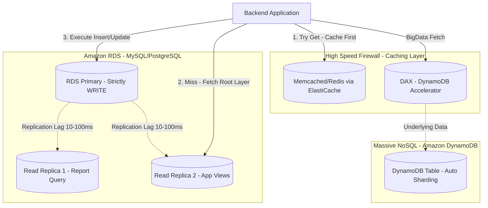

# 🗄️ Deep Dive: Database Scaling Architecture On AWS

Scaling the storage layer is the ultimate test of a Senior Architect. While stateless Compute tiers (EC2, Lambda) scale horizontally with ease, data has gravity. Relational Databases (RDBMS) despise horizontal scaling due to ACID constraints.

This guide explores the multi-tiered caching strategies and the transition from monolithic RDS to distributed DynamoDB.

## 🗺️ Advanced Database Layer Separation Diagram

---

## 1. Relational DB (RDS): Pushing the Limits

### Read Scale-Out (CQRS Light)
In a typical web application, 80-90% of database queries are Reads.
- **Why?** Constantly upgrading the Primary DB size (Vertical Scaling) hits a hard limit (e.g., `db.r5.24xlarge`).
- **The Solution:** Offload READ traffic to **Amazon RDS Read Replicas**. AWS allows creating up to 15 replicas within/across Regions.
- **Architectural Trap (Replication Lag):** RDS replicates data asynchronously based on physical block changes (WAL/Binlog). During high write bursts, the replica might lag behind by several seconds. A user updating their password and logging in immediately might hit a Replica and fail authentication because the new password hash hasn't synced yet.
- **Mitigation:** Route critical reads (e.g., just after a write) directly to the Primary. Use connection pooling (like PgBouncer or Amazon RDS Proxy) to prevent exhausting open connection limits.

### Amazon Aurora: The Cloud-Native Evolution
When standard RDS is insufficient, Aurora separates **Compute** from **Storage**.
- Instead of EC2 instances copying data via EBS, the Aurora Database engines share a distributed, highly durable storage layer (replicated 6 ways across 3 AZs).
- **Aurora Serverless v2:** Solves unpredictable user patterns by scaling compute capacity in fractions of a second (measured in ACUs), perfect for multi-tenant applications or sudden flash sales where capacity needs spike dramatically.

---

## 2. The Move to NoSQL: Amazon DynamoDB

When you reach thousands of Writes per Second (WPS) and relationships don't matter, you hit the boundary of RDBMS. At scale, `JOIN` operations become poison.

### DynamoDB Core Architecture
DynamoDB uses **Consistent Hashing** to distribute data partitions across thousands of unseen servers.
- **Partition Key:** Is vital. If your Partition Key specifies `country_id`, all users from "USA" land on a single partition server, causing a **Hot Partition** and subsequent Throttling limits (exceeding 3000 RCU or 1000 WCU per partition).
- **The Architect's Job:** Design composite keys (e.g., `user_id_hash`) or append random suffixes to high-traffic attributes to forcefully scatter writes evenly across the fleet.

### Data Access Patterns (Single-Table Design)
Unlike SQL where you normalize (Users, Orders, Items), NoSQL requires **Denormalization**. 
- A Senior Architect determines all access patterns *before* creating the table.
- Utilizing **Global Secondary Indexes (GSI)** locally copies and re-sorts data to support queries like "Get all orders for User Y", solving the limitation of DynamoDB not supporting arbitrary ad-hoc queries.

---

## 3. The Ultimate Firewall: Caching Layers

Without caching, the Database will inevitably die under Thundering Herds.

- **Amazon ElastiCache (Redis):** Handles sub-millisecond lookups for session states, pre-rendered HTML snippets, or expensive query results. Configurable as a multi-node cluster for High Availability.
- **Cache Invalidation:** The hardest problem in computer science. Implementing sophisticated strategies (Write-Through, Write-Behind, TTLs, or Pub/Sub cache busting).
- **DAX (DynamoDB Accelerator):** An incredibly narrow use-case cache. If even DynamoDB's 5ms latency is too slow (e.g., Ad-bidding engines needing 0.5ms reads), DAX acts as an identical in-memory proxy for DynamoDB, natively understanding the API so developers don't need to rewrite code.
