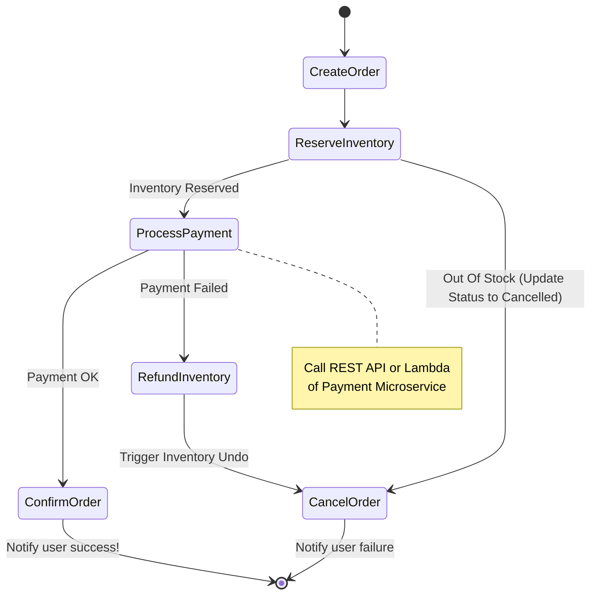

# 🔄 Saga Pattern: Distributed Transactions With AWS Step Functions

How do Order Service, Payment Service, and Inventory Service all consistently "Commit" info simultaneously while living on 3 different Databases? Solve the Distributed Transactions problem entirely by turning **AWS Step Functions** into an "Orchestrator" overseeing the direct call flow.

## 🗺️ Ordering State Machine Diagram (Saga)

If `ProcessPayment` fails while scanning the credit card, the flow automatically routes to the `RefundInventory` path to return the item to the warehouse database (**Compensating Transaction** concept).

## Practical Implementation:
- **AWS Step Functions** creates a visual State Machine running on the Cloud. You drag and drop JSON/ASL (Amazon States Language) to define the flow above.
- Each State (Block) will Invoke an **AWS Lambda Function**, call an **ECS/Fargate Task**, or throw a message directly into **SQS**.
- Why use Step Functions and NOT Choreography via Kafka/SQS directly?
  - Easy Monitoring (looking at the Step Functions graph, you know exactly which block a Transaction is stuck at).
  - Built-in error handling blocks (Catchers & Retries).
  - Huge scale and very cheap (AWS charges by State Transitions).
