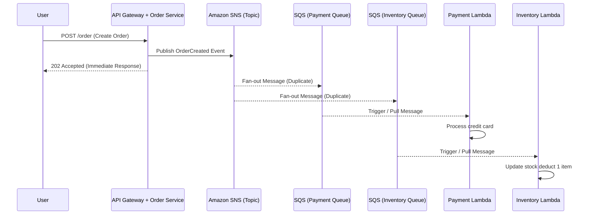

# ⚡ Event-Driven Architecture On AWS

With AWS, decoupling Microservices via Event-Driven Architecture becomes incredibly flexible thanks to powerful support from Amazon `SNS`, `SQS`, and `EventBridge`.

## 🗺️ Pub/Sub & Fan-out Process Diagram

Order purchase example: The API does only one thing, receives the order, publishes the Event, and goes to sleep. The rest (Payment, Inventory deduction, Email) runs asynchronously in the background.

## Core AWS Solutions:
1. **Amazon SQS (Simple Queue Service) - Point-to-Point**: 
   - A queue holding messages (Buffer/Load Leveling). 
   - Guarantees at-least-once Delivery. 
   - If the `Payment Lambda` crashes, the message remains stuck in SQS. When Lambda revives, it grabs it again -> Never lose an order.
2. **Amazon SNS (Simple Notification Service) - Pub/Sub**: 
   - Push messages (Fan-out) to hundreds of subscribers simultaneously (SQS queue, Lambda, Email, SMS).
3. **Amazon EventBridge - Enterprise Event Bus**: 
   - A higher-level event hub than SNS. Smart branching capabilities: e.g., "If Order > $1000, throw to VIP queue for manual Sales review, if < $1000 throw to Auto-Approve queue".
4. **Dead Letter Queue (DLQ)**: 
   - If a message is retried past its limit (due to code bug or bad data), it automatically lands in DLQ for engineer review. A must configure for Asynchronous design!
