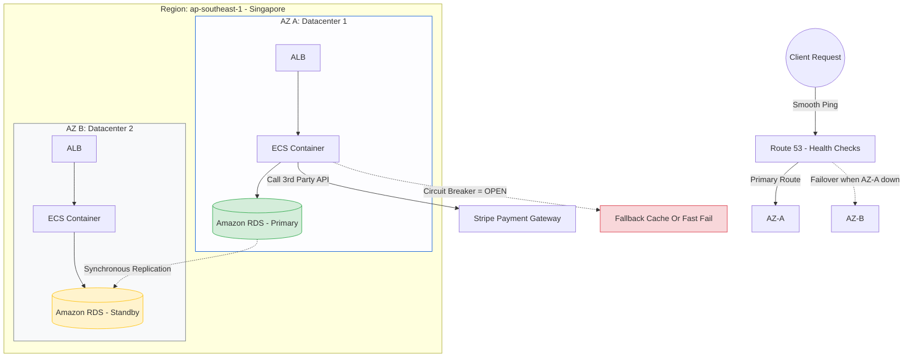

# 🛡️ Resiliency & High Availability On AWS

Architectural design must be ready to endure a Database suddenly crashing, or worse, an entire Amazon Data Center (Zone) losing power. That's why you configure a 2-layer Fallback.

## 🗺️ Multi-AZ Self-Healing Capability Diagram

## Durability Factors Architects Must Memorize:
1. **Multi-AZ Deployment for Amazon RDS**: 
   - AWS maintains a *hidden Standby* in another Zone via Sync Connection. When Primary hits disk bottlenecks or loses power, AWS elevates Standby to Primary and repoints the CNAME within 60 seconds (Auto-Failover). Zero Downtime Database.
2. **Route 53 Health Checks & Failover**: 
   - Route53 continually Pings `ALB_A`. If ALB dies, it redirects all global Traffic to the `ALB_B` standby cluster. 
3. **AWS API Gateway Rate Limiting vs WAF**: 
   - Prevent internal server collapse due to unexpected Peak Traffic or DDoS attacks using Quotas/Throttling right at the API Layer, before Requests reach the back-end Lambda/EC2s.
4. **In-Code Circuit Breaker**:
   - If Stripe cable cuts, App_A shouldn't attempt to Retry 10,000 times (It will crash internal servers from exhausted Connection Pools). The Circuit Breaker trips instantly, returning a "Wallet under maintenance" message immediately.
