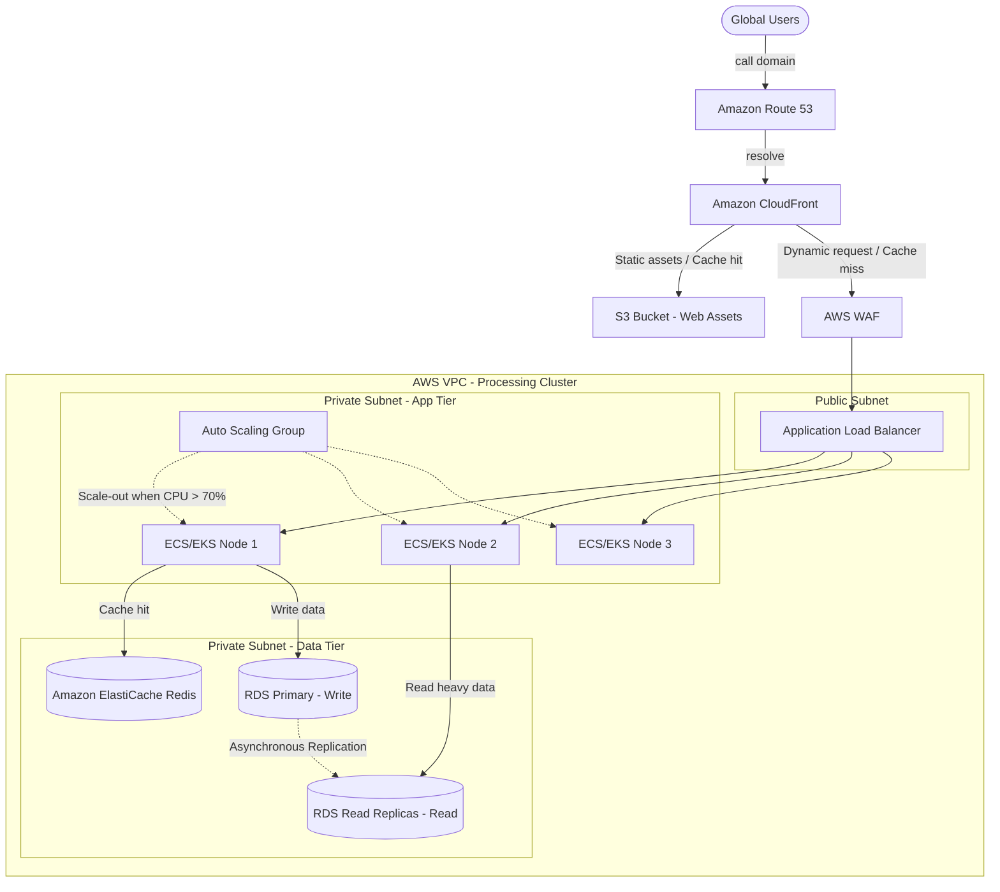

# 🚀 Deep Dive: Scaling From Zero To Millions Of Users On AWS

To serve massive traffic, AWS provides a robust ecosystem covering Load Balancing, Caching, and Auto Scaling. However, true Senior Architecture is not just about placing these components on a diagram; it's about understanding their limits, tuning their configurations, and anticipating failure domains.

## 🗺️ Million-User Architecture Diagram

---

## 🏗️ Deep Dive Component Analysis

### 1. Edge Layer: Route 53 & CloudFront
A Senior Architect knows that the cheapest and fastest request is the one that never hits your backend.
- **Route 53 Routing Policies**: Beyond simple routing, you must utilize **Latency-Based Routing** to direct users to the AWS Region closest to them, or **Weighted Routing** for Blue/Green deployments (e.g., 10% traffic to the new V2 cluster).
- **CloudFront Cache Invalidation Strategy**: Invalidating the CDN cache is expensive and slow. Instead of invalidating `index.html`, use **Cache Busting** (e.g., embedding a hash in the filename `app_v1.2.3.js`).
- **WAF Rate Limiting**: Configure WAF to block IPs requesting more than 100 req/sec to mitigate Layer 7 DDoS attacks, saving ALB costs (ALB charges per LCU - Load Balancer Capacity Unit).

### 2. Application Load Balancer (ALB) Tuning
ALB is not a magical infinite pipe; it needs time to scale.
- **Pre-warming**: If you anticipate a sudden spike (e.g., Black Friday flash sale at 00:00), the ALB will crash before AWS can scale it seamlessly. You must contact AWS Support to **pre-warm** the ALB.
- **Connection Draining (Deregistration Delay)**: Set this carefully (default is 300s). During a scale-in (terminating an EC2 instance), ALB waits for in-flight requests to finish. If your API responses take 2 seconds, reduce this to 10-15s so the instance shuts down faster and saves money.
- **Sticky Sessions (Session Affinity)**: **Avoid this at all costs.** It breaks the stateless nature of backend nodes. If you must use session state, store it in ElastiCache (Redis), not in the EC2 node's RAM.

### 3. Auto Scaling Group (ASG) & Compute Tier
- **Scaling Policies**: 
  - *Target Tracking*: The modern approach (e.g., "Keep average CPU at 60%"). 
  - *Step Scaling*: Better for explosive workloads (e.g., "If CPU > 80%, add 5 instances instantly, not 1").
- **Cooldown Periods**: Prevents ASG from launching too many instances simultaneously due to lagging CloudWatch metrics. Always ensure your application startup time (Node.js/Java boot up) is accounted for in the cooldown.
- **Stateless Design**: Your EC2/ECS containers must be 100% ephemeral. Any local file uploads must be streamed directly to S3. Local disk is lost upon Scale-in.

### 4. Data Tier: RDS & ElastiCache Limitations
When scaling to millions, the Database is always the bottleneck (The State problem).
- **ElastiCache (Redis) Strategies**:
  - *Cache-Aside (Lazy Loading)*: App checks cache -> if miss, queries DB -> saves to cache. Best for general read-heavy workloads.
  - *Cache Stampede (Thundering Herd)*: When a highly requested cache key expires, 10,000 requests instantly hit the DB and crash it. **Solution**: Implement a Mutex Lock (only 1 thread goes to DB to fetch data, others wait 50ms) or use Probabilistic Early Expiration.
- **RDS Read Replica Lag**: 
  - RDS replicates data to Read Replicas asynchronously. If a user updates their profile (Written to Master) and gets redirected to the profile page (Read from Replica), they might see old data because replication takes 10-100ms.
  - **Solution**: "Read-Your-Own-Writes" pattern. For 5 seconds after a user writes, force their specific read queries to hit the Master node, while other users read from the Replica.

## ⚖️ Trade-offs and Considerations
1. **Cost vs High Availability**: Running a Multi-AZ RDS cluster doubles the cost. Running a 3-node ElastiCache Cluster triples it. For non-critical systems, an Architect might choose Single-AZ and rely on automated nightly snapshots.
2. **Eventual vs Strong Consistency**: Horizontal scaling forces you into Eventual Consistency. You must educate the Business/Product team that it is acceptable for a "Like" count to be off by a few seconds.
